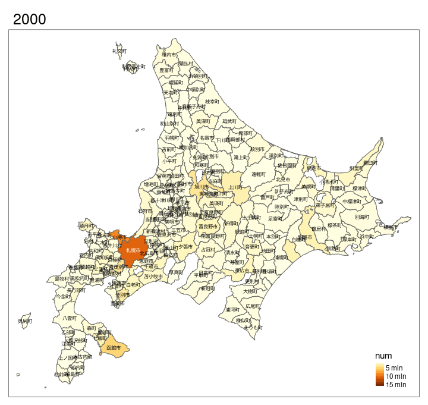
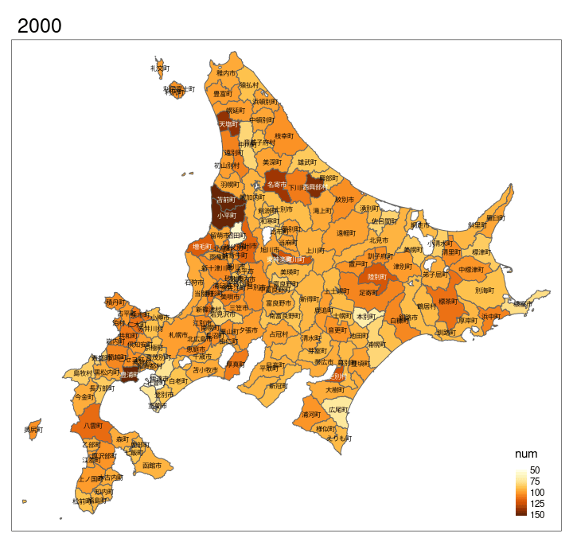

```{r setup, include=FALSE}
knitr::opts_chunk$set(echo = TRUE)
```

```{r lib-in, include=FALSE}
library(sf)
library(raster)
library(dplyr)
library(spData)
library(spDataLarge)
library(tmap)    # for static and interactive maps
library(leaflet) # for interactive maps
library(ggplot2) # tidyverse data visualization package
install.packages("openxlsx")
library(openxlsx)
install.packages("gifski")
library(gifski)
```

```{r functionSet, include=FALSE}
# データの読み込みと整形. a=0:合計 a=1:対前年比
loadData <- function(year, a){
  data = read.xlsx(paste0("../data/", as.character(year), ".xlsx"))
  data = data %>% filter(区.分 == "入込総数") %>% filter(!is.na(市町村名))
  if(a==0){
    if(year < 2010)
      col_name = "年間合計"
    else
      col_name = "合計"
    data = data %>% select(市町村名, all_of(col_name))
    numbers = as.numeric(unlist(data[col_name])) * 1000
    if(year == 2021) # 2021年は4~9月のみのため倍にしている
      numbers = numbers*2
  }else{
    col_name = "対前年比"
    data = data %>% select(市町村名, all_of(col_name))
    numbers = as.numeric(unlist(data[col_name]))
    if(year==2010) # 2010年のみ表記が違う
      numbers = numbers*100
  }  
  data["num"] = numbers
  data = data %>%
    select(市町村名, num)
}
```

```{r loadData_and_makeMap, include=FALSE}
# gifの作成

hkd_map = st_read("../data/hokkaido_map_4612.geojson")
hkd_map = hkd_map[1]

# 入込客数の合計
for(i in 0:21){
  data = loadData(i+2000, 0)
  map_data = left_join(data, hkd_map, by="市町村名")
  year = array(i+2000, c(nrow(map_data)))
  map_data["year"] = year
  if(i == 0)
    fin_data = map_data
  else
    fin_data = rbind(fin_data, map_data)
}
fin_data = st_as_sf(fin_data)
tmap_mode("plot")
anim_map = tm_shape(fin_data) + tm_borders() + 
  tm_text("市町村名", size=0.5) + tm_fill("num", style="cont") +
  tm_facets(along = "year", free.coords = FALSE)
tmap_animation(anim_map, filename = "./figures/anim_map_sum.gif", delay = 60)


# 入込客数の対前年比
for(i in 0:21){
  data = loadData(i+2000, 1)
  map_data = left_join(data, hkd_map, by="市町村名")
  year = array(i+2000, c(nrow(map_data)))
  map_data["year"] = year
  if(i == 0)
    fin_data = map_data
  else
    fin_data = rbind(fin_data, map_data)
}
fin_data = st_as_sf(fin_data)
tmap_mode("plot")
breaks = c(50, 75, 100, 125, 150)
anim_map = tm_shape(fin_data) + tm_borders() + 
  tm_text("市町村名", size=0.5) + tm_fill("num", style="cont", breaks=breaks) +
  tm_facets(along = "year", free.coords = FALSE)
tmap_animation(anim_map, filename = "./figures/anim_map_rat.gif", delay = 60)
```


## 0. 要旨
本レポートでは2000年度以降の各市町村における観光入込客数を地図で描画し、俯瞰して見ることで北海道の各地域、年度における観光業について分析した。
また、本レポートでは2020年度及び2021年度前期のデータも扱うことで、新型コロナウイルスによる観光業への影響についても考察した。

<br>
<br>

## 1. はじめに
### 1.1 背景
近年、北海道ではその自然やグルメに注目が集まり、観光業が盛んになっている。
しかし北海道は日本で最も広大な土地を持つ都道府県であり、当然各市町村によって観光業の発展具合は異なると考えられる。
そこで、北海道の観光入込客数を各市町村、各年度ごとに地図で描画し、俯瞰的に考察するのが良いと考えた。
200近い市町村によって構成される北海道は地図を用いる分析が向いていると考えたこともこのテーマを選んだ理由の1つである。

### 1.2 目的
各年度ごとの観光入込客数について分析することで、観光業の盛んな都道府県の1つである北海道における観光客の分布及び推移を見ていく。
その中で有用な知見や発見を得ることが目的である。

## 2. 手法
各年度における北海道各市町村の観光入込客数を地図に描画する。
ここでは各年度における観光入込客数の合計と対前年度比をそれぞれ描画する。

## 3. データ
本レポートで主に扱う観光入込客数とは、北海道の内外問わずその市町村を訪れた人の数のことである。

観光入込客数のデータは[@tourists_data]のものを用いた。
このサイトでは2000年度以降のデータがexcelファイル形式で、それ以前のデータがPDF形式のみで配布されている。
PDF形式のデータは処理が難しいため使用を断念し、2000年度以降のデータのみを使用する。
2021年度については、4月から9月までの前期のデータのみが公開されている。
本レポートでは2021年度のデータをできるだけ他年度と同様に扱うために、2021年度の観光入込客数を2倍にして地図に描画している。
そのため、2021年度の地図については参考程度の扱いとなる。
また、北海道では2000年度時点で213あった市町村が合併等により2020年度には179となっている。
この過程で市町村名が変わっている地域も多く、最後に合併があった2009年度までは地図に抜けている箇所がある。

地図のデータは[@map_data]のものを使用した。

## 4. 結果
```{r sum_gif, fig.cap="図1. 各年度における観光入込客数の合計(単位:人)"}

```

```{r rat_gif, fig.cap="図2. 各年度における観光入込客数の対前年度比(単位:%)"}

```

図1からは市町村によって明らかな観光入込客数の偏りがあることが分かった。
旭川市や釧路市以外の観光入込客数が多い市町村は南西に集まっていることも地図から読み取ることができた。

また、図2からは2020年度にほとんどの市町村で対前年度比の観光入込客数が減少していることが分かった。

## 5. 考察
図1から、北海道の観光入込客数には市町村の位置によって明らかな偏りが見られた。
これは北海道が広大で道内の移動にも時間がかかるため、自然と観光客が近い市町村を巡ることが多いからだと考えられる。
また、観光入込客数の多い市町村の中でも札幌市は特に多く、2000年度から2019年度にかけて観光入込客数が特に増加していた。
北海道を訪れる観光客の多くは、札幌市を中心として周囲の他市町村を巡る形で観光しているのだと考えられる。

図2からは2020年度の対前年度比の観光入込客数がほぼ全市町村で減少していることが分かった。
これはやはり新型コロナウイルスの影響が観光客数に強く出ていることが分かった。

## 6. 結論
本レポートでは2000年度以降の各市町村における観光入込客数を地図で描画し、俯瞰して見ることで北海道の各地域、年度における観光業について分析した。
結果、北海道を訪れる観光客は札幌市を中心として、周辺の各市町村を観光している人が多いのではないかと考察した。
また、新型コロナウイルスが北海道全体で観光業に強く影響していることも分かった。

## 7. Graphic Abstract
```{r sum_gif_2, fig.cap="図3. 各年度における観光入込客数の合計比(再掲)"}

```

## 8. 参考文献