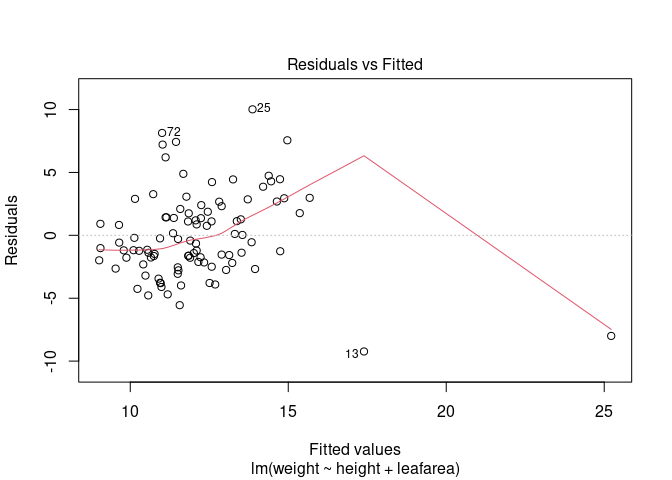
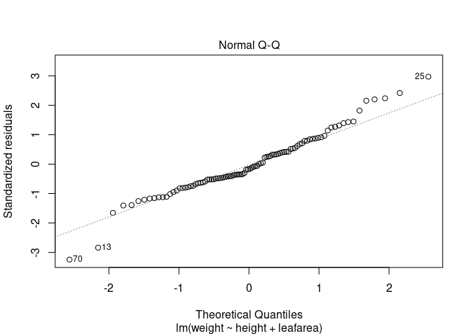
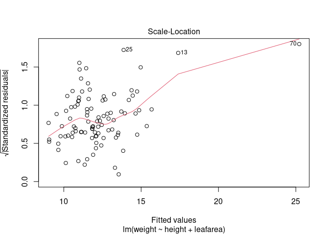
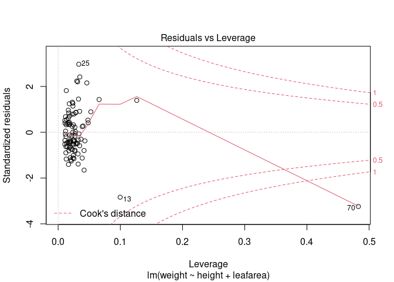

第３・４回目
================
22MM337：星澤知宙
4/19/2021

## R Markdown

# chapter 2

``` r
# this is comment
2+1
```

    ## [1] 3

``` r
log(3)
```

    ## [1] 1.098612

``` r
exp(2.7)
```

    ## [1] 14.87973

``` r
# object
my_obj = 48
My_obj = 48

# character
my_obj2 = "R study"
print(my_obj2)
```

    ## [1] "R study"

``` r
#add
 my_obj + My_obj  # OK
```

    ## [1] 96

``` r
#my_obj + my_obj2 # NG

 my_obj3 = "is cool."
#my_obj2 + my_obj3 #NG

paste(my_obj2, my_obj3)
```

    ## [1] "R study is cool."

``` r
# vector
my_vec = c(3,5,2,46,6,10)
print(my_vec)
```

    ## [1]  3  5  2 46  6 10

``` r
mean(my_vec)
```

    ## [1] 12

``` r
var(my_vec)
```

    ## [1] 285.2

``` r
sd(my_vec)
```

    ## [1] 16.88787

``` r
length(my_vec)
```

    ## [1] 6

``` r
my_vec2 = c(3,5,2,46,6,10,NA)
var(my_vec2, na.rm=T)
```

    ## [1] 285.2

``` r
my_seq = 1:10
print(my_seq)
```

    ##  [1]  1  2  3  4  5  6  7  8  9 10

``` r
my_seq2 = seq(from=1,to=5,by=0.5)
```

``` r
print(my_vec)
```

    ## [1]  3  5  2 46  6 10

``` r
print(my_vec[3]) # Rのインデックスは1から
```

    ## [1] 2

``` r
val_3 = my_vec[3]

my_vec[c(1,5,6,8)]
```

    ## [1]  3  6 10 NA

``` r
id = c(1,5,6,8)
print(my_vec[id])
```

    ## [1]  3  6 10 NA

``` r
print(my_vec > 4)
```

    ## [1] FALSE  TRUE FALSE  TRUE  TRUE  TRUE

``` r
my_vec[my_vec > 4]
```

    ## [1]  5 46  6 10

``` r
id3 = my_vec < 6 & my_vec > 2
my_vec[id3]
```

    ## [1] 3 5

``` r
id4 = my_vec > 6 | my_vec < 3
my_vec[id4]
```

    ## [1]  2 46 10

# chapter 3

``` r
num = 2.2
char = "hello."
logi = T
class(num)
```

    ## [1] "numeric"

``` r
class(char)
```

    ## [1] "character"

``` r
class(logi)
```

    ## [1] "logical"

``` r
is.numeric(num)
```

    ## [1] TRUE

``` r
is.character(char)
```

    ## [1] TRUE

``` r
is.logical(logi)
```

    ## [1] TRUE

``` r
num_char = as.character(num)
print(num_char)
```

    ## [1] "2.2"

``` r
class(num_char)
```

    ## [1] "character"

``` r
my_mat = matrix(data=1:16, nrow=4, byrow=T)
print(my_mat)
```

    ##      [,1] [,2] [,3] [,4]
    ## [1,]    1    2    3    4
    ## [2,]    5    6    7    8
    ## [3,]    9   10   11   12
    ## [4,]   13   14   15   16

``` r
my_array = array(data=1:16, dim=c(2,4,2))
print(my_array)
```

    ## , , 1
    ## 
    ##      [,1] [,2] [,3] [,4]
    ## [1,]    1    3    5    7
    ## [2,]    2    4    6    8
    ## 
    ## , , 2
    ## 
    ##      [,1] [,2] [,3] [,4]
    ## [1,]    9   11   13   15
    ## [2,]   10   12   14   16

``` r
print(my_array[,,1]) # pythonから:を抜いた感じ
```

    ##      [,1] [,2] [,3] [,4]
    ## [1,]    1    3    5    7
    ## [2,]    2    4    6    8

``` r
print(my_array[1,,])
```

    ##      [,1] [,2]
    ## [1,]    1    9
    ## [2,]    3   11
    ## [3,]    5   13
    ## [4,]    7   15

``` r
rownames(my_mat) = c("A","B","C","D")
colnames(my_mat) = c("a","b","c","d")
my_mat
```

    ##    a  b  c  d
    ## A  1  2  3  4
    ## B  5  6  7  8
    ## C  9 10 11 12
    ## D 13 14 15 16

``` r
#list
list_1 = list(c("black", "yellow", "orange"),
             c(TRUE, TRUE, FALSE, TRUE, FALSE, FALSE),
             matrix(1:6, nrow = 3)) 
list_1
```

    ## [[1]]
    ## [1] "black"  "yellow" "orange"
    ## 
    ## [[2]]
    ## [1]  TRUE  TRUE FALSE  TRUE FALSE FALSE
    ## 
    ## [[3]]
    ##      [,1] [,2]
    ## [1,]    1    4
    ## [2,]    2    5
    ## [3,]    3    6

``` r
list_2 = list(colors = c("black", "yellow", "orange"),
              evaluation = c(TRUE, TRUE, FALSE, TRUE, FALSE, FALSE),
              time = matrix(1:6, nrow = 3))
list_2
```

    ## $colors
    ## [1] "black"  "yellow" "orange"
    ## 
    ## $evaluation
    ## [1]  TRUE  TRUE FALSE  TRUE FALSE FALSE
    ## 
    ## $time
    ##      [,1] [,2]
    ## [1,]    1    4
    ## [2,]    2    5
    ## [3,]    3    6

``` r
list_2$colors
```

    ## [1] "black"  "yellow" "orange"

``` r
str(list_2) #structures
```

    ## List of 3
    ##  $ colors    : chr [1:3] "black" "yellow" "orange"
    ##  $ evaluation: logi [1:6] TRUE TRUE FALSE TRUE FALSE FALSE
    ##  $ time      : int [1:3, 1:2] 1 2 3 4 5 6

``` r
#data frames
#pandasに近い
p.height <- c(180, 155, 160, 167, 181)
p.weight <- c(65, 50, 52, 58, 70)
p.names <- c("Joanna", "Charlotte", "Helen", "Karen", "Amy")

dataf = data.frame(height=p.height, weight=p.weight, names=p.names)
dataf
```

    ##   height weight     names
    ## 1    180     65    Joanna
    ## 2    155     50 Charlotte
    ## 3    160     52     Helen
    ## 4    167     58     Karen
    ## 5    181     70       Amy

``` r
dim(dataf)
```

    ## [1] 5 3

``` r
str(dataf)
```

    ## 'data.frame':    5 obs. of  3 variables:
    ##  $ height: num  180 155 160 167 181
    ##  $ weight: num  65 50 52 58 70
    ##  $ names : chr  "Joanna" "Charlotte" "Helen" "Karen" ...

``` r
dataf$height
```

    ## [1] 180 155 160 167 181

``` r
flower <- read.csv("~/class/l03-04/flower.csv")
str(flower)
```

    ## 'data.frame':    96 obs. of  8 variables:
    ##  $ treat    : chr  "tip" "tip" "tip" "tip" ...
    ##  $ nitrogen : chr  "medium" "medium" "medium" "medium" ...
    ##  $ block    : int  1 1 1 1 1 1 1 1 2 2 ...
    ##  $ height   : num  7.5 10.7 11.2 10.4 10.4 9.8 6.9 9.4 10.4 12.3 ...
    ##  $ weight   : num  7.62 12.14 12.76 8.78 13.58 ...
    ##  $ leafarea : num  11.7 14.1 7.1 11.9 14.5 12.2 13.2 14 10.5 16.1 ...
    ##  $ shootarea: num  31.9 46 66.7 20.3 26.9 72.7 43.1 28.5 57.8 36.9 ...
    ##  $ flowers  : int  1 10 10 1 4 9 7 6 5 8 ...

``` r
flower$height
```

    ##  [1]  7.5 10.7 11.2 10.4 10.4  9.8  6.9  9.4 10.4 12.3 10.4 11.0  7.1  6.0  9.0
    ## [16]  4.5 12.6 10.0 10.0  8.5 14.1 10.1  8.5  6.5 11.5  7.7  6.4  8.8  9.2  6.2
    ## [31]  6.3 17.2  8.0  8.0  6.4  7.6  9.7 12.3  9.1  8.9  7.4  3.1  7.9  8.8  8.5
    ## [46]  5.6 11.5  5.8  5.6  5.3  7.5  4.1  3.5  8.5  4.9  2.5  5.4  3.9  5.8  4.5
    ## [61]  8.0  1.8  2.2  3.9  8.5  8.5  6.4  1.2  2.6 10.9  7.2  2.1  4.7  5.0  6.5
    ## [76]  2.6  6.0  9.3  4.6  5.2  3.9  2.3  5.2  2.2  4.5  1.8  3.0  3.7  2.4  5.7
    ## [91]  3.7  3.2  3.9  3.3  5.5  4.4

``` r
summary(flower$height)
```

    ##    Min. 1st Qu.  Median    Mean 3rd Qu.    Max. 
    ##   1.200   4.475   6.450   6.840   9.025  17.200

``` r
#3.4.1
flower[1,4] # 1行4列目の要素
```

    ## [1] 7.5

``` r
flower[,c(1,4)] # 1列目と4列目
```

    ##    treat height
    ## 1    tip    7.5
    ## 2    tip   10.7
    ## 3    tip   11.2
    ## 4    tip   10.4
    ## 5    tip   10.4
    ## 6    tip    9.8
    ## 7    tip    6.9
    ## 8    tip    9.4
    ## 9    tip   10.4
    ## 10   tip   12.3
    ## 11   tip   10.4
    ## 12   tip   11.0
    ## 13   tip    7.1
    ## 14   tip    6.0
    ## 15   tip    9.0
    ## 16   tip    4.5
    ## 17   tip   12.6
    ## 18   tip   10.0
    ## 19   tip   10.0
    ## 20   tip    8.5
    ## 21   tip   14.1
    ## 22   tip   10.1
    ## 23   tip    8.5
    ## 24   tip    6.5
    ## 25   tip   11.5
    ## 26   tip    7.7
    ## 27   tip    6.4
    ## 28   tip    8.8
    ## 29   tip    9.2
    ## 30   tip    6.2
    ## 31   tip    6.3
    ## 32   tip   17.2
    ## 33   tip    8.0
    ## 34   tip    8.0
    ## 35   tip    6.4
    ## 36   tip    7.6
    ## 37   tip    9.7
    ## 38   tip   12.3
    ## 39   tip    9.1
    ## 40   tip    8.9
    ## 41   tip    7.4
    ## 42   tip    3.1
    ## 43   tip    7.9
    ## 44   tip    8.8
    ## 45   tip    8.5
    ## 46   tip    5.6
    ## 47   tip   11.5
    ## 48   tip    5.8
    ## 49 notip    5.6
    ## 50 notip    5.3
    ## 51 notip    7.5
    ## 52 notip    4.1
    ## 53 notip    3.5
    ## 54 notip    8.5
    ## 55 notip    4.9
    ## 56 notip    2.5
    ## 57 notip    5.4
    ## 58 notip    3.9
    ## 59 notip    5.8
    ## 60 notip    4.5
    ## 61 notip    8.0
    ## 62 notip    1.8
    ## 63 notip    2.2
    ## 64 notip    3.9
    ## 65 notip    8.5
    ## 66 notip    8.5
    ## 67 notip    6.4
    ## 68 notip    1.2
    ## 69 notip    2.6
    ## 70 notip   10.9
    ## 71 notip    7.2
    ## 72 notip    2.1
    ## 73 notip    4.7
    ## 74 notip    5.0
    ## 75 notip    6.5
    ## 76 notip    2.6
    ## 77 notip    6.0
    ## 78 notip    9.3
    ## 79 notip    4.6
    ## 80 notip    5.2
    ## 81 notip    3.9
    ## 82 notip    2.3
    ## 83 notip    5.2
    ## 84 notip    2.2
    ## 85 notip    4.5
    ## 86 notip    1.8
    ## 87 notip    3.0
    ## 88 notip    3.7
    ## 89 notip    2.4
    ## 90 notip    5.7
    ## 91 notip    3.7
    ## 92 notip    3.2
    ## 93 notip    3.9
    ## 94 notip    3.3
    ## 95 notip    5.5
    ## 96 notip    4.4

``` r
flower[c(1,4),] # 1行目と4行目
```

    ##   treat nitrogen block height weight leafarea shootarea flowers
    ## 1   tip   medium     1    7.5   7.62     11.7      31.9       1
    ## 4   tip   medium     1   10.4   8.78     11.9      20.3       1

# tidyverse

``` r
#モダンなR言語のパッケージ
library(tidyverse)
```

    ## ── Attaching packages ─────────────────────────────────────── tidyverse 1.3.0 ──

    ## ✓ ggplot2 3.3.3     ✓ purrr   0.3.4
    ## ✓ tibble  3.1.0     ✓ dplyr   1.0.5
    ## ✓ tidyr   1.1.3     ✓ stringr 1.4.0
    ## ✓ readr   1.4.0     ✓ forcats 0.5.1

    ## Warning: package 'purrr' was built under R version 4.0.5

    ## ── Conflicts ────────────────────────────────────────── tidyverse_conflicts() ──
    ## x dplyr::filter() masks stats::filter()
    ## x dplyr::lag()    masks stats::lag()

``` r
flower %>% select(height)
```

    ##    height
    ## 1     7.5
    ## 2    10.7
    ## 3    11.2
    ## 4    10.4
    ## 5    10.4
    ## 6     9.8
    ## 7     6.9
    ## 8     9.4
    ## 9    10.4
    ## 10   12.3
    ## 11   10.4
    ## 12   11.0
    ## 13    7.1
    ## 14    6.0
    ## 15    9.0
    ## 16    4.5
    ## 17   12.6
    ## 18   10.0
    ## 19   10.0
    ## 20    8.5
    ## 21   14.1
    ## 22   10.1
    ## 23    8.5
    ## 24    6.5
    ## 25   11.5
    ## 26    7.7
    ## 27    6.4
    ## 28    8.8
    ## 29    9.2
    ## 30    6.2
    ## 31    6.3
    ## 32   17.2
    ## 33    8.0
    ## 34    8.0
    ## 35    6.4
    ## 36    7.6
    ## 37    9.7
    ## 38   12.3
    ## 39    9.1
    ## 40    8.9
    ## 41    7.4
    ## 42    3.1
    ## 43    7.9
    ## 44    8.8
    ## 45    8.5
    ## 46    5.6
    ## 47   11.5
    ## 48    5.8
    ## 49    5.6
    ## 50    5.3
    ## 51    7.5
    ## 52    4.1
    ## 53    3.5
    ## 54    8.5
    ## 55    4.9
    ## 56    2.5
    ## 57    5.4
    ## 58    3.9
    ## 59    5.8
    ## 60    4.5
    ## 61    8.0
    ## 62    1.8
    ## 63    2.2
    ## 64    3.9
    ## 65    8.5
    ## 66    8.5
    ## 67    6.4
    ## 68    1.2
    ## 69    2.6
    ## 70   10.9
    ## 71    7.2
    ## 72    2.1
    ## 73    4.7
    ## 74    5.0
    ## 75    6.5
    ## 76    2.6
    ## 77    6.0
    ## 78    9.3
    ## 79    4.6
    ## 80    5.2
    ## 81    3.9
    ## 82    2.3
    ## 83    5.2
    ## 84    2.2
    ## 85    4.5
    ## 86    1.8
    ## 87    3.0
    ## 88    3.7
    ## 89    2.4
    ## 90    5.7
    ## 91    3.7
    ## 92    3.2
    ## 93    3.9
    ## 94    3.3
    ## 95    5.5
    ## 96    4.4

``` r
flower %>% select(height, weight)
```

    ##    height weight
    ## 1     7.5   7.62
    ## 2    10.7  12.14
    ## 3    11.2  12.76
    ## 4    10.4   8.78
    ## 5    10.4  13.58
    ## 6     9.8  10.08
    ## 7     6.9  10.11
    ## 8     9.4  10.28
    ## 9    10.4  10.48
    ## 10   12.3  13.48
    ## 11   10.4  13.18
    ## 12   11.0  11.56
    ## 13    7.1   8.16
    ## 14    6.0  11.22
    ## 15    9.0  10.20
    ## 16    4.5  12.55
    ## 17   12.6  18.66
    ## 18   10.0  18.07
    ## 19   10.0  13.29
    ## 20    8.5  14.33
    ## 21   14.1  19.12
    ## 22   10.1  15.49
    ## 23    8.5  17.82
    ## 24    6.5  17.13
    ## 25   11.5  23.89
    ## 26    7.7  14.77
    ## 27    6.4  13.60
    ## 28    8.8  16.58
    ## 29    9.2  13.26
    ## 30    6.2  17.32
    ## 31    6.3  14.50
    ## 32   17.2  19.20
    ## 33    8.0   6.88
    ## 34    8.0  10.23
    ## 35    6.4   5.97
    ## 36    7.6  13.05
    ## 37    9.7   6.49
    ## 38   12.3  11.27
    ## 39    9.1   8.96
    ## 40    8.9  11.48
    ## 41    7.4  10.89
    ## 42    3.1   8.74
    ## 43    7.9   8.89
    ## 44    8.8   9.39
    ## 45    8.5   7.16
    ## 46    5.6   8.10
    ## 47   11.5   8.72
    ## 48    5.8   8.04
    ## 49    5.6  11.03
    ## 50    5.3   9.29
    ## 51    7.5  13.60
    ## 52    4.1  12.58
    ## 53    3.5  12.93
    ## 54    8.5  10.04
    ## 55    4.9   6.89
    ## 56    2.5  14.85
    ## 57    5.4  11.36
    ## 58    3.9   9.07
    ## 59    5.8  10.18
    ## 60    4.5  13.68
    ## 61    8.0  11.43
    ## 62    1.8  10.47
    ## 63    2.2  10.70
    ## 64    3.9  12.97
    ## 65    8.5  22.53
    ## 66    8.5  17.33
    ## 67    6.4  11.52
    ## 68    1.2  18.24
    ## 69    2.6  16.57
    ## 70   10.9  17.22
    ## 71    7.2  15.21
    ## 72    2.1  19.15
    ## 73    4.7  13.42
    ## 74    5.0  16.82
    ## 75    6.5  14.00
    ## 76    2.6  18.88
    ## 77    6.0  13.68
    ## 78    9.3  18.75
    ## 79    4.6  14.65
    ## 80    5.2  17.70
    ## 81    3.9   7.17
    ## 82    2.3   7.28
    ## 83    5.2   5.79
    ## 84    2.2   9.97
    ## 85    4.5   8.60
    ## 86    1.8   6.01
    ## 87    3.0   9.93
    ## 88    3.7   7.03
    ## 89    2.4   9.10
    ## 90    5.7   9.05
    ## 91    3.7   8.10
    ## 92    3.2   7.45
    ## 93    3.9   9.19
    ## 94    3.3   8.92
    ## 95    5.5   8.44
    ## 96    4.4  10.60

``` r
flower %>% select(-height, -weight)
```

    ##    treat nitrogen block leafarea shootarea flowers
    ## 1    tip   medium     1     11.7      31.9       1
    ## 2    tip   medium     1     14.1      46.0      10
    ## 3    tip   medium     1      7.1      66.7      10
    ## 4    tip   medium     1     11.9      20.3       1
    ## 5    tip   medium     1     14.5      26.9       4
    ## 6    tip   medium     1     12.2      72.7       9
    ## 7    tip   medium     1     13.2      43.1       7
    ## 8    tip   medium     1     14.0      28.5       6
    ## 9    tip   medium     2     10.5      57.8       5
    ## 10   tip   medium     2     16.1      36.9       8
    ## 11   tip   medium     2     11.1      56.8      12
    ## 12   tip   medium     2     12.6      31.3       6
    ## 13   tip   medium     2     29.6       9.7       2
    ## 14   tip   medium     2     13.0      16.4       3
    ## 15   tip   medium     2     10.8      90.1       6
    ## 16   tip   medium     2     13.4      14.4       6
    ## 17   tip     high     1     18.6      54.0       9
    ## 18   tip     high     1     16.9      90.5       3
    ## 19   tip     high     1     15.8     142.7      12
    ## 20   tip     high     1     13.2      91.4       5
    ## 21   tip     high     1     13.1     113.2      13
    ## 22   tip     high     1     12.6      77.2      12
    ## 23   tip     high     1     20.5      54.4       3
    ## 24   tip     high     1     24.1     147.4       6
    ## 25   tip     high     2     14.3     101.5      12
    ## 26   tip     high     2     17.2     104.5       4
    ## 27   tip     high     2     13.6     152.6       7
    ## 28   tip     high     2     16.7     100.1       9
    ## 29   tip     high     2     11.3     108.0       9
    ## 30   tip     high     2     11.6      85.9       5
    ## 31   tip     high     2     18.3      55.6       8
    ## 32   tip     high     2     10.9      89.9      14
    ## 33   tip      low     1      9.3      16.1       4
    ## 34   tip      low     1     11.9      88.1       4
    ## 35   tip      low     1      8.7       7.3       2
    ## 36   tip      low     1      7.2      47.2       8
    ## 37   tip      low     1      8.1      18.0       3
    ## 38   tip      low     1     13.7      28.7       5
    ## 39   tip      low     1      9.7      23.8       3
    ## 40   tip      low     1     11.1      39.4       7
    ## 41   tip      low     2     13.3       9.5       5
    ## 42   tip      low     2     16.1      39.1       3
    ## 43   tip      low     2      8.4      34.1       4
    ## 44   tip      low     2      7.1      38.9       4
    ## 45   tip      low     2      8.7      29.9       4
    ## 46   tip      low     2     10.1       5.8       2
    ## 47   tip      low     2     10.2      28.3       6
    ## 48   tip      low     2      5.8      30.7       7
    ## 49 notip   medium     1     18.6      49.9       8
    ## 50 notip   medium     1     11.5      82.3       6
    ## 51 notip   medium     1     13.6     122.2      11
    ## 52 notip   medium     1     13.9     136.6      11
    ## 53 notip   medium     1     16.6     109.3       3
    ## 54 notip   medium     1     12.3     113.6       4
    ## 55 notip   medium     1      8.2      52.9       3
    ## 56 notip   medium     1     17.5      77.8      10
    ## 57 notip   medium     2     17.8     104.6      12
    ## 58 notip   medium     2      9.6      90.4       7
    ## 59 notip   medium     2     15.7      88.8       6
    ## 60 notip   medium     2     14.8     125.5       9
    ## 61 notip   medium     2     12.6      43.2      14
    ## 62 notip   medium     2     11.8     120.8       9
    ## 63 notip   medium     2     15.3      97.1       7
    ## 64 notip   medium     2     17.0      97.5       5
    ## 65 notip     high     1     20.8     166.9      16
    ## 66 notip     high     1     19.8     184.4      12
    ## 67 notip     high     1     12.1     140.5       7
    ## 68 notip     high     1     16.6     148.1       7
    ## 69 notip     high     1     17.1     141.1       3
    ## 70 notip     high     1     49.2     189.6      17
    ## 71 notip     high     1     15.9     135.0      14
    ## 72 notip     high     1     15.6     176.7       6
    ## 73 notip     high     2     19.8     124.7       5
    ## 74 notip     high     2     17.3     182.5      15
    ## 75 notip     high     2     10.1     126.5       7
    ## 76 notip     high     2     16.4     181.5      14
    ## 77 notip     high     2     16.2     133.7       2
    ## 78 notip     high     2     18.4     181.1      16
    ## 79 notip     high     2     16.7      91.7      11
    ## 80 notip     high     2     19.1     181.1       8
    ## 81 notip      low     1     13.5      52.8       6
    ## 82 notip      low     1     13.8      32.8       6
    ## 83 notip      low     1     11.0      67.4       5
    ## 84 notip      low     1      9.6      63.1       2
    ## 85 notip      low     1      9.4     113.5       7
    ## 86 notip      low     1     17.6      46.2       4
    ## 87 notip      low     1     12.0      56.6       6
    ## 88 notip      low     1      7.9      36.7       5
    ## 89 notip      low     2     14.5      78.7       8
    ## 90 notip      low     2      9.6      63.2       6
    ## 91 notip      low     2     10.5      60.5       6
    ## 92 notip      low     2     14.1      38.1       4
    ## 93 notip      low     2     12.4      52.6       9
    ## 94 notip      low     2     11.6      55.2       6
    ## 95 notip      low     2     13.5      77.6       9
    ## 96 notip      low     2     16.2      63.3       6

``` r
flower_height = flower %>% select(height)
flower_height
```

    ##    height
    ## 1     7.5
    ## 2    10.7
    ## 3    11.2
    ## 4    10.4
    ## 5    10.4
    ## 6     9.8
    ## 7     6.9
    ## 8     9.4
    ## 9    10.4
    ## 10   12.3
    ## 11   10.4
    ## 12   11.0
    ## 13    7.1
    ## 14    6.0
    ## 15    9.0
    ## 16    4.5
    ## 17   12.6
    ## 18   10.0
    ## 19   10.0
    ## 20    8.5
    ## 21   14.1
    ## 22   10.1
    ## 23    8.5
    ## 24    6.5
    ## 25   11.5
    ## 26    7.7
    ## 27    6.4
    ## 28    8.8
    ## 29    9.2
    ## 30    6.2
    ## 31    6.3
    ## 32   17.2
    ## 33    8.0
    ## 34    8.0
    ## 35    6.4
    ## 36    7.6
    ## 37    9.7
    ## 38   12.3
    ## 39    9.1
    ## 40    8.9
    ## 41    7.4
    ## 42    3.1
    ## 43    7.9
    ## 44    8.8
    ## 45    8.5
    ## 46    5.6
    ## 47   11.5
    ## 48    5.8
    ## 49    5.6
    ## 50    5.3
    ## 51    7.5
    ## 52    4.1
    ## 53    3.5
    ## 54    8.5
    ## 55    4.9
    ## 56    2.5
    ## 57    5.4
    ## 58    3.9
    ## 59    5.8
    ## 60    4.5
    ## 61    8.0
    ## 62    1.8
    ## 63    2.2
    ## 64    3.9
    ## 65    8.5
    ## 66    8.5
    ## 67    6.4
    ## 68    1.2
    ## 69    2.6
    ## 70   10.9
    ## 71    7.2
    ## 72    2.1
    ## 73    4.7
    ## 74    5.0
    ## 75    6.5
    ## 76    2.6
    ## 77    6.0
    ## 78    9.3
    ## 79    4.6
    ## 80    5.2
    ## 81    3.9
    ## 82    2.3
    ## 83    5.2
    ## 84    2.2
    ## 85    4.5
    ## 86    1.8
    ## 87    3.0
    ## 88    3.7
    ## 89    2.4
    ## 90    5.7
    ## 91    3.7
    ## 92    3.2
    ## 93    3.9
    ## 94    3.3
    ## 95    5.5
    ## 96    4.4

``` r
head(flower)
```

    ##   treat nitrogen block height weight leafarea shootarea flowers
    ## 1   tip   medium     1    7.5   7.62     11.7      31.9       1
    ## 2   tip   medium     1   10.7  12.14     14.1      46.0      10
    ## 3   tip   medium     1   11.2  12.76      7.1      66.7      10
    ## 4   tip   medium     1   10.4   8.78     11.9      20.3       1
    ## 5   tip   medium     1   10.4  13.58     14.5      26.9       4
    ## 6   tip   medium     1    9.8  10.08     12.2      72.7       9

``` r
flower %>% filter(nitrogen == "high")
```

    ##    treat nitrogen block height weight leafarea shootarea flowers
    ## 1    tip     high     1   12.6  18.66     18.6      54.0       9
    ## 2    tip     high     1   10.0  18.07     16.9      90.5       3
    ## 3    tip     high     1   10.0  13.29     15.8     142.7      12
    ## 4    tip     high     1    8.5  14.33     13.2      91.4       5
    ## 5    tip     high     1   14.1  19.12     13.1     113.2      13
    ## 6    tip     high     1   10.1  15.49     12.6      77.2      12
    ## 7    tip     high     1    8.5  17.82     20.5      54.4       3
    ## 8    tip     high     1    6.5  17.13     24.1     147.4       6
    ## 9    tip     high     2   11.5  23.89     14.3     101.5      12
    ## 10   tip     high     2    7.7  14.77     17.2     104.5       4
    ## 11   tip     high     2    6.4  13.60     13.6     152.6       7
    ## 12   tip     high     2    8.8  16.58     16.7     100.1       9
    ## 13   tip     high     2    9.2  13.26     11.3     108.0       9
    ## 14   tip     high     2    6.2  17.32     11.6      85.9       5
    ## 15   tip     high     2    6.3  14.50     18.3      55.6       8
    ## 16   tip     high     2   17.2  19.20     10.9      89.9      14
    ## 17 notip     high     1    8.5  22.53     20.8     166.9      16
    ## 18 notip     high     1    8.5  17.33     19.8     184.4      12
    ## 19 notip     high     1    6.4  11.52     12.1     140.5       7
    ## 20 notip     high     1    1.2  18.24     16.6     148.1       7
    ## 21 notip     high     1    2.6  16.57     17.1     141.1       3
    ## 22 notip     high     1   10.9  17.22     49.2     189.6      17
    ## 23 notip     high     1    7.2  15.21     15.9     135.0      14
    ## 24 notip     high     1    2.1  19.15     15.6     176.7       6
    ## 25 notip     high     2    4.7  13.42     19.8     124.7       5
    ## 26 notip     high     2    5.0  16.82     17.3     182.5      15
    ## 27 notip     high     2    6.5  14.00     10.1     126.5       7
    ## 28 notip     high     2    2.6  18.88     16.4     181.5      14
    ## 29 notip     high     2    6.0  13.68     16.2     133.7       2
    ## 30 notip     high     2    9.3  18.75     18.4     181.1      16
    ## 31 notip     high     2    4.6  14.65     16.7      91.7      11
    ## 32 notip     high     2    5.2  17.70     19.1     181.1       8

``` r
flower %>%
  filter(nitrogen == "high") %>%
  filter(height > 13) %>%
  select(height, weight)
```

    ##   height weight
    ## 1   14.1  19.12
    ## 2   17.2  19.20

``` r
#data frameでどう処理するか(問題)
flower[flower$nitrogen=="high" & flower$height>13, c("height","weight")]
```

    ##    height weight
    ## 21   14.1  19.12
    ## 32   17.2  19.20

``` r
id1 = flower$nitrogen=="high"
id2 = flower$height>13
id3 = id1 & id2
flower[id3, c("height","weight")]
```

    ##    height weight
    ## 21   14.1  19.12
    ## 32   17.2  19.20

``` r
#add column
flower2 = flower %>%
  mutate(height_cm = height/10)
flower2
```

    ##    treat nitrogen block height weight leafarea shootarea flowers height_cm
    ## 1    tip   medium     1    7.5   7.62     11.7      31.9       1      0.75
    ## 2    tip   medium     1   10.7  12.14     14.1      46.0      10      1.07
    ## 3    tip   medium     1   11.2  12.76      7.1      66.7      10      1.12
    ## 4    tip   medium     1   10.4   8.78     11.9      20.3       1      1.04
    ## 5    tip   medium     1   10.4  13.58     14.5      26.9       4      1.04
    ## 6    tip   medium     1    9.8  10.08     12.2      72.7       9      0.98
    ## 7    tip   medium     1    6.9  10.11     13.2      43.1       7      0.69
    ## 8    tip   medium     1    9.4  10.28     14.0      28.5       6      0.94
    ## 9    tip   medium     2   10.4  10.48     10.5      57.8       5      1.04
    ## 10   tip   medium     2   12.3  13.48     16.1      36.9       8      1.23
    ## 11   tip   medium     2   10.4  13.18     11.1      56.8      12      1.04
    ## 12   tip   medium     2   11.0  11.56     12.6      31.3       6      1.10
    ## 13   tip   medium     2    7.1   8.16     29.6       9.7       2      0.71
    ## 14   tip   medium     2    6.0  11.22     13.0      16.4       3      0.60
    ## 15   tip   medium     2    9.0  10.20     10.8      90.1       6      0.90
    ## 16   tip   medium     2    4.5  12.55     13.4      14.4       6      0.45
    ## 17   tip     high     1   12.6  18.66     18.6      54.0       9      1.26
    ## 18   tip     high     1   10.0  18.07     16.9      90.5       3      1.00
    ## 19   tip     high     1   10.0  13.29     15.8     142.7      12      1.00
    ## 20   tip     high     1    8.5  14.33     13.2      91.4       5      0.85
    ## 21   tip     high     1   14.1  19.12     13.1     113.2      13      1.41
    ## 22   tip     high     1   10.1  15.49     12.6      77.2      12      1.01
    ## 23   tip     high     1    8.5  17.82     20.5      54.4       3      0.85
    ## 24   tip     high     1    6.5  17.13     24.1     147.4       6      0.65
    ## 25   tip     high     2   11.5  23.89     14.3     101.5      12      1.15
    ## 26   tip     high     2    7.7  14.77     17.2     104.5       4      0.77
    ## 27   tip     high     2    6.4  13.60     13.6     152.6       7      0.64
    ## 28   tip     high     2    8.8  16.58     16.7     100.1       9      0.88
    ## 29   tip     high     2    9.2  13.26     11.3     108.0       9      0.92
    ## 30   tip     high     2    6.2  17.32     11.6      85.9       5      0.62
    ## 31   tip     high     2    6.3  14.50     18.3      55.6       8      0.63
    ## 32   tip     high     2   17.2  19.20     10.9      89.9      14      1.72
    ## 33   tip      low     1    8.0   6.88      9.3      16.1       4      0.80
    ## 34   tip      low     1    8.0  10.23     11.9      88.1       4      0.80
    ## 35   tip      low     1    6.4   5.97      8.7       7.3       2      0.64
    ## 36   tip      low     1    7.6  13.05      7.2      47.2       8      0.76
    ## 37   tip      low     1    9.7   6.49      8.1      18.0       3      0.97
    ## 38   tip      low     1   12.3  11.27     13.7      28.7       5      1.23
    ## 39   tip      low     1    9.1   8.96      9.7      23.8       3      0.91
    ## 40   tip      low     1    8.9  11.48     11.1      39.4       7      0.89
    ## 41   tip      low     2    7.4  10.89     13.3       9.5       5      0.74
    ## 42   tip      low     2    3.1   8.74     16.1      39.1       3      0.31
    ## 43   tip      low     2    7.9   8.89      8.4      34.1       4      0.79
    ## 44   tip      low     2    8.8   9.39      7.1      38.9       4      0.88
    ## 45   tip      low     2    8.5   7.16      8.7      29.9       4      0.85
    ## 46   tip      low     2    5.6   8.10     10.1       5.8       2      0.56
    ## 47   tip      low     2   11.5   8.72     10.2      28.3       6      1.15
    ## 48   tip      low     2    5.8   8.04      5.8      30.7       7      0.58
    ## 49 notip   medium     1    5.6  11.03     18.6      49.9       8      0.56
    ## 50 notip   medium     1    5.3   9.29     11.5      82.3       6      0.53
    ## 51 notip   medium     1    7.5  13.60     13.6     122.2      11      0.75
    ## 52 notip   medium     1    4.1  12.58     13.9     136.6      11      0.41
    ## 53 notip   medium     1    3.5  12.93     16.6     109.3       3      0.35
    ## 54 notip   medium     1    8.5  10.04     12.3     113.6       4      0.85
    ## 55 notip   medium     1    4.9   6.89      8.2      52.9       3      0.49
    ## 56 notip   medium     1    2.5  14.85     17.5      77.8      10      0.25
    ## 57 notip   medium     2    5.4  11.36     17.8     104.6      12      0.54
    ## 58 notip   medium     2    3.9   9.07      9.6      90.4       7      0.39
    ## 59 notip   medium     2    5.8  10.18     15.7      88.8       6      0.58
    ## 60 notip   medium     2    4.5  13.68     14.8     125.5       9      0.45
    ## 61 notip   medium     2    8.0  11.43     12.6      43.2      14      0.80
    ## 62 notip   medium     2    1.8  10.47     11.8     120.8       9      0.18
    ## 63 notip   medium     2    2.2  10.70     15.3      97.1       7      0.22
    ## 64 notip   medium     2    3.9  12.97     17.0      97.5       5      0.39
    ## 65 notip     high     1    8.5  22.53     20.8     166.9      16      0.85
    ## 66 notip     high     1    8.5  17.33     19.8     184.4      12      0.85
    ## 67 notip     high     1    6.4  11.52     12.1     140.5       7      0.64
    ## 68 notip     high     1    1.2  18.24     16.6     148.1       7      0.12
    ## 69 notip     high     1    2.6  16.57     17.1     141.1       3      0.26
    ## 70 notip     high     1   10.9  17.22     49.2     189.6      17      1.09
    ## 71 notip     high     1    7.2  15.21     15.9     135.0      14      0.72
    ## 72 notip     high     1    2.1  19.15     15.6     176.7       6      0.21
    ## 73 notip     high     2    4.7  13.42     19.8     124.7       5      0.47
    ## 74 notip     high     2    5.0  16.82     17.3     182.5      15      0.50
    ## 75 notip     high     2    6.5  14.00     10.1     126.5       7      0.65
    ## 76 notip     high     2    2.6  18.88     16.4     181.5      14      0.26
    ## 77 notip     high     2    6.0  13.68     16.2     133.7       2      0.60
    ## 78 notip     high     2    9.3  18.75     18.4     181.1      16      0.93
    ## 79 notip     high     2    4.6  14.65     16.7      91.7      11      0.46
    ## 80 notip     high     2    5.2  17.70     19.1     181.1       8      0.52
    ## 81 notip      low     1    3.9   7.17     13.5      52.8       6      0.39
    ## 82 notip      low     1    2.3   7.28     13.8      32.8       6      0.23
    ## 83 notip      low     1    5.2   5.79     11.0      67.4       5      0.52
    ## 84 notip      low     1    2.2   9.97      9.6      63.1       2      0.22
    ## 85 notip      low     1    4.5   8.60      9.4     113.5       7      0.45
    ## 86 notip      low     1    1.8   6.01     17.6      46.2       4      0.18
    ## 87 notip      low     1    3.0   9.93     12.0      56.6       6      0.30
    ## 88 notip      low     1    3.7   7.03      7.9      36.7       5      0.37
    ## 89 notip      low     2    2.4   9.10     14.5      78.7       8      0.24
    ## 90 notip      low     2    5.7   9.05      9.6      63.2       6      0.57
    ## 91 notip      low     2    3.7   8.10     10.5      60.5       6      0.37
    ## 92 notip      low     2    3.2   7.45     14.1      38.1       4      0.32
    ## 93 notip      low     2    3.9   9.19     12.4      52.6       9      0.39
    ## 94 notip      low     2    3.3   8.92     11.6      55.2       6      0.33
    ## 95 notip      low     2    5.5   8.44     13.5      77.6       9      0.55
    ## 96 notip      low     2    4.4  10.60     16.2      63.3       6      0.44

# chapter 6

``` r
#y ~ x1 + x2
#weight = height ~ leafarea

flower
```

    ##    treat nitrogen block height weight leafarea shootarea flowers
    ## 1    tip   medium     1    7.5   7.62     11.7      31.9       1
    ## 2    tip   medium     1   10.7  12.14     14.1      46.0      10
    ## 3    tip   medium     1   11.2  12.76      7.1      66.7      10
    ## 4    tip   medium     1   10.4   8.78     11.9      20.3       1
    ## 5    tip   medium     1   10.4  13.58     14.5      26.9       4
    ## 6    tip   medium     1    9.8  10.08     12.2      72.7       9
    ## 7    tip   medium     1    6.9  10.11     13.2      43.1       7
    ## 8    tip   medium     1    9.4  10.28     14.0      28.5       6
    ## 9    tip   medium     2   10.4  10.48     10.5      57.8       5
    ## 10   tip   medium     2   12.3  13.48     16.1      36.9       8
    ## 11   tip   medium     2   10.4  13.18     11.1      56.8      12
    ## 12   tip   medium     2   11.0  11.56     12.6      31.3       6
    ## 13   tip   medium     2    7.1   8.16     29.6       9.7       2
    ## 14   tip   medium     2    6.0  11.22     13.0      16.4       3
    ## 15   tip   medium     2    9.0  10.20     10.8      90.1       6
    ## 16   tip   medium     2    4.5  12.55     13.4      14.4       6
    ## 17   tip     high     1   12.6  18.66     18.6      54.0       9
    ## 18   tip     high     1   10.0  18.07     16.9      90.5       3
    ## 19   tip     high     1   10.0  13.29     15.8     142.7      12
    ## 20   tip     high     1    8.5  14.33     13.2      91.4       5
    ## 21   tip     high     1   14.1  19.12     13.1     113.2      13
    ## 22   tip     high     1   10.1  15.49     12.6      77.2      12
    ## 23   tip     high     1    8.5  17.82     20.5      54.4       3
    ## 24   tip     high     1    6.5  17.13     24.1     147.4       6
    ## 25   tip     high     2   11.5  23.89     14.3     101.5      12
    ## 26   tip     high     2    7.7  14.77     17.2     104.5       4
    ## 27   tip     high     2    6.4  13.60     13.6     152.6       7
    ## 28   tip     high     2    8.8  16.58     16.7     100.1       9
    ## 29   tip     high     2    9.2  13.26     11.3     108.0       9
    ## 30   tip     high     2    6.2  17.32     11.6      85.9       5
    ## 31   tip     high     2    6.3  14.50     18.3      55.6       8
    ## 32   tip     high     2   17.2  19.20     10.9      89.9      14
    ## 33   tip      low     1    8.0   6.88      9.3      16.1       4
    ## 34   tip      low     1    8.0  10.23     11.9      88.1       4
    ## 35   tip      low     1    6.4   5.97      8.7       7.3       2
    ## 36   tip      low     1    7.6  13.05      7.2      47.2       8
    ## 37   tip      low     1    9.7   6.49      8.1      18.0       3
    ## 38   tip      low     1   12.3  11.27     13.7      28.7       5
    ## 39   tip      low     1    9.1   8.96      9.7      23.8       3
    ## 40   tip      low     1    8.9  11.48     11.1      39.4       7
    ## 41   tip      low     2    7.4  10.89     13.3       9.5       5
    ## 42   tip      low     2    3.1   8.74     16.1      39.1       3
    ## 43   tip      low     2    7.9   8.89      8.4      34.1       4
    ## 44   tip      low     2    8.8   9.39      7.1      38.9       4
    ## 45   tip      low     2    8.5   7.16      8.7      29.9       4
    ## 46   tip      low     2    5.6   8.10     10.1       5.8       2
    ## 47   tip      low     2   11.5   8.72     10.2      28.3       6
    ## 48   tip      low     2    5.8   8.04      5.8      30.7       7
    ## 49 notip   medium     1    5.6  11.03     18.6      49.9       8
    ## 50 notip   medium     1    5.3   9.29     11.5      82.3       6
    ## 51 notip   medium     1    7.5  13.60     13.6     122.2      11
    ## 52 notip   medium     1    4.1  12.58     13.9     136.6      11
    ## 53 notip   medium     1    3.5  12.93     16.6     109.3       3
    ## 54 notip   medium     1    8.5  10.04     12.3     113.6       4
    ## 55 notip   medium     1    4.9   6.89      8.2      52.9       3
    ## 56 notip   medium     1    2.5  14.85     17.5      77.8      10
    ## 57 notip   medium     2    5.4  11.36     17.8     104.6      12
    ## 58 notip   medium     2    3.9   9.07      9.6      90.4       7
    ## 59 notip   medium     2    5.8  10.18     15.7      88.8       6
    ## 60 notip   medium     2    4.5  13.68     14.8     125.5       9
    ## 61 notip   medium     2    8.0  11.43     12.6      43.2      14
    ## 62 notip   medium     2    1.8  10.47     11.8     120.8       9
    ## 63 notip   medium     2    2.2  10.70     15.3      97.1       7
    ## 64 notip   medium     2    3.9  12.97     17.0      97.5       5
    ## 65 notip     high     1    8.5  22.53     20.8     166.9      16
    ## 66 notip     high     1    8.5  17.33     19.8     184.4      12
    ## 67 notip     high     1    6.4  11.52     12.1     140.5       7
    ## 68 notip     high     1    1.2  18.24     16.6     148.1       7
    ## 69 notip     high     1    2.6  16.57     17.1     141.1       3
    ## 70 notip     high     1   10.9  17.22     49.2     189.6      17
    ## 71 notip     high     1    7.2  15.21     15.9     135.0      14
    ## 72 notip     high     1    2.1  19.15     15.6     176.7       6
    ## 73 notip     high     2    4.7  13.42     19.8     124.7       5
    ## 74 notip     high     2    5.0  16.82     17.3     182.5      15
    ## 75 notip     high     2    6.5  14.00     10.1     126.5       7
    ## 76 notip     high     2    2.6  18.88     16.4     181.5      14
    ## 77 notip     high     2    6.0  13.68     16.2     133.7       2
    ## 78 notip     high     2    9.3  18.75     18.4     181.1      16
    ## 79 notip     high     2    4.6  14.65     16.7      91.7      11
    ## 80 notip     high     2    5.2  17.70     19.1     181.1       8
    ## 81 notip      low     1    3.9   7.17     13.5      52.8       6
    ## 82 notip      low     1    2.3   7.28     13.8      32.8       6
    ## 83 notip      low     1    5.2   5.79     11.0      67.4       5
    ## 84 notip      low     1    2.2   9.97      9.6      63.1       2
    ## 85 notip      low     1    4.5   8.60      9.4     113.5       7
    ## 86 notip      low     1    1.8   6.01     17.6      46.2       4
    ## 87 notip      low     1    3.0   9.93     12.0      56.6       6
    ## 88 notip      low     1    3.7   7.03      7.9      36.7       5
    ## 89 notip      low     2    2.4   9.10     14.5      78.7       8
    ## 90 notip      low     2    5.7   9.05      9.6      63.2       6
    ## 91 notip      low     2    3.7   8.10     10.5      60.5       6
    ## 92 notip      low     2    3.2   7.45     14.1      38.1       4
    ## 93 notip      low     2    3.9   9.19     12.4      52.6       9
    ## 94 notip      low     2    3.3   8.92     11.6      55.2       6
    ## 95 notip      low     2    5.5   8.44     13.5      77.6       9
    ## 96 notip      low     2    4.4  10.60     16.2      63.3       6

``` r
# linear modelling
ans = lm(weight ~ height + leafarea, data=flower)
summary(ans)
```

    ## 
    ## Call:
    ## lm(formula = weight ~ height + leafarea, data = flower)
    ## 
    ## Residuals:
    ##     Min      1Q  Median      3Q     Max 
    ## -9.2367 -2.1258 -0.5653  1.9314 10.0211 
    ## 
    ## Coefficients:
    ##             Estimate Std. Error t value Pr(>|t|)    
    ## (Intercept)   5.1039     1.2441   4.102 8.76e-05 ***
    ## height        0.3502     0.1109   3.159  0.00213 ** 
    ## leafarea      0.3313     0.0659   5.027 2.41e-06 ***
    ## ---
    ## Signif. codes:  0 '***' 0.001 '**' 0.01 '*' 0.05 '.' 0.1 ' ' 1
    ## 
    ## Residual standard error: 3.43 on 93 degrees of freedom
    ## Multiple R-squared:  0.2758, Adjusted R-squared:  0.2602 
    ## F-statistic: 17.71 on 2 and 93 DF,  p-value: 3.045e-07

``` r
plot(ans)
```

<!-- --><!-- --><!-- --><!-- -->

# chapter 7

``` r
test_func = function(x){
  y = x-1
  return(y)
}

test_func(4)
```

    ## [1] 3

``` r
for(i in 1:5){
  print(i)
}
```

    ## [1] 1
    ## [1] 2
    ## [1] 3
    ## [1] 4
    ## [1] 5
