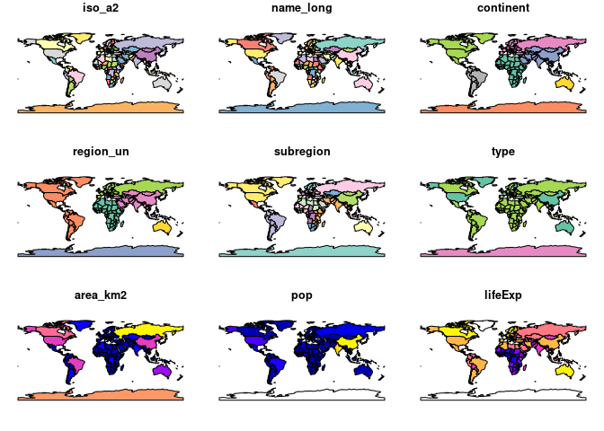

第５・６回目
================
22MM337：星澤知宙
5/23/2022

## R Markdown

# chapter 1

``` r
library(leaflet)
popup = c("Robin", "Jakub", "Jannes")
leaflet() %>%
  addProviderTiles("NASAGIBS.ViirsEarthAtNight2012") %>%
  addMarkers(lng = c(-3, 23, 11), #経度
             lat = c(52, 53, 49), #緯度
             popup = popup)
```

    ## PhantomJS not found. You can install it with webshot::install_phantomjs(). If it is installed, please make sure the phantomjs executable can be found via the PATH variable.

<div id="htmlwidget-bd433bdf6d9779d0ab40" style="width:672px;height:480px;" class="leaflet html-widget"></div>
<script type="application/json" data-for="htmlwidget-bd433bdf6d9779d0ab40">{"x":{"options":{"crs":{"crsClass":"L.CRS.EPSG3857","code":null,"proj4def":null,"projectedBounds":null,"options":{}}},"calls":[{"method":"addProviderTiles","args":["NASAGIBS.ViirsEarthAtNight2012",null,null,{"errorTileUrl":"","noWrap":false,"detectRetina":false}]},{"method":"addMarkers","args":[[52,53,49],[-3,23,11],null,null,null,{"interactive":true,"draggable":false,"keyboard":true,"title":"","alt":"","zIndexOffset":0,"opacity":1,"riseOnHover":false,"riseOffset":250},["Robin","Jakub","Jannes"],null,null,null,null,{"interactive":false,"permanent":false,"direction":"auto","opacity":1,"offset":[0,0],"textsize":"10px","textOnly":false,"className":"","sticky":true},null]}],"limits":{"lat":[49,53],"lng":[-3,23]}},"evals":[],"jsHooks":[]}</script>

``` r
library(leaflet)
popup2 = c("Las Vegas", "London", "Switzerland", "Sydney")
leaflet() %>%
  addProviderTiles("OpenStreetMap.HOT") %>%
  addCircleMarkers(lng = c(-115, 0, 9, 151), #経度
             lat = c(36, 51, 47, -34), #緯度
             popup = popup2)
```

<div id="htmlwidget-8c9dc461647310d05b68" style="width:672px;height:480px;" class="leaflet html-widget"></div>
<script type="application/json" data-for="htmlwidget-8c9dc461647310d05b68">{"x":{"options":{"crs":{"crsClass":"L.CRS.EPSG3857","code":null,"proj4def":null,"projectedBounds":null,"options":{}}},"calls":[{"method":"addProviderTiles","args":["OpenStreetMap.HOT",null,null,{"errorTileUrl":"","noWrap":false,"detectRetina":false}]},{"method":"addCircleMarkers","args":[[36,51,47,-34],[-115,0,9,151],10,null,null,{"interactive":true,"className":"","stroke":true,"color":"#03F","weight":5,"opacity":0.5,"fill":true,"fillColor":"#03F","fillOpacity":0.2},null,null,["Las Vegas","London","Switzerland","Sydney"],null,null,{"interactive":false,"permanent":false,"direction":"auto","opacity":1,"offset":[0,0],"textsize":"10px","textOnly":false,"className":"","sticky":true},null]}],"limits":{"lat":[-34,51],"lng":[-115,151]}},"evals":[],"jsHooks":[]}</script>

# chapter 2

``` r
install.packages("sf")
```

    ## Installing package into '/usr/local/lib/R/site-library'
    ## (as 'lib' is unspecified)

    ## Warning in install.packages("sf"): installation of package 'sf' had non-zero
    ## exit status

``` r
install.packages("raster")
```

    ## Installing package into '/usr/local/lib/R/site-library'
    ## (as 'lib' is unspecified)

``` r
install.packages("spData")
```

    ## Installing package into '/usr/local/lib/R/site-library'
    ## (as 'lib' is unspecified)

``` r
#remotes::install_github("Nowosad/spDataLarge")

library(sf)
```

    ## Linking to GEOS 3.8.0, GDAL 3.0.4, PROJ 6.3.1

``` r
library(raster)
```

    ## Loading required package: sp

``` r
library(spData)
library(spDataLarge)
```

``` r
world
```

    ## Simple feature collection with 177 features and 10 fields
    ## Geometry type: MULTIPOLYGON
    ## Dimension:     XY
    ## Bounding box:  xmin: -180 ymin: -90 xmax: 180 ymax: 83.64513
    ## Geodetic CRS:  WGS 84
    ## # A tibble: 177 x 11
    ##    iso_a2 name_long continent region_un subregion type  area_km2     pop lifeExp
    ##    <chr>  <chr>     <chr>     <chr>     <chr>     <chr>    <dbl>   <dbl>   <dbl>
    ##  1 FJ     Fiji      Oceania   Oceania   Melanesia Sove…   1.93e4  8.86e5    70.0
    ##  2 TZ     Tanzania  Africa    Africa    Eastern … Sove…   9.33e5  5.22e7    64.2
    ##  3 EH     Western … Africa    Africa    Northern… Inde…   9.63e4 NA         NA  
    ##  4 CA     Canada    North Am… Americas  Northern… Sove…   1.00e7  3.55e7    82.0
    ##  5 US     United S… North Am… Americas  Northern… Coun…   9.51e6  3.19e8    78.8
    ##  6 KZ     Kazakhst… Asia      Asia      Central … Sove…   2.73e6  1.73e7    71.6
    ##  7 UZ     Uzbekist… Asia      Asia      Central … Sove…   4.61e5  3.08e7    71.0
    ##  8 PG     Papua Ne… Oceania   Oceania   Melanesia Sove…   4.65e5  7.76e6    65.2
    ##  9 ID     Indonesia Asia      Asia      South-Ea… Sove…   1.82e6  2.55e8    68.9
    ## 10 AR     Argentina South Am… Americas  South Am… Sove…   2.78e6  4.30e7    76.3
    ## # … with 167 more rows, and 2 more variables: gdpPercap <dbl>,
    ## #   geom <MULTIPOLYGON [°]>

``` r
names(world)
```

    ##  [1] "iso_a2"    "name_long" "continent" "region_un" "subregion" "type"     
    ##  [7] "area_km2"  "pop"       "lifeExp"   "gdpPercap" "geom"

``` r
summary(world["lifeExp"])
```

    ##     lifeExp                 geom    
    ##  Min.   :50.62   MULTIPOLYGON :177  
    ##  1st Qu.:64.96   epsg:4326    :  0  
    ##  Median :72.87   +proj=long...:  0  
    ##  Mean   :70.85                      
    ##  3rd Qu.:76.78                      
    ##  Max.   :83.59                      
    ##  NA's   :10

``` r
plot(world)
```

    ## Warning: plotting the first 9 out of 10 attributes; use max.plot = 10 to plot
    ## all

<!-- -->

``` r
world["lifeExp"] #これの属するdata.frameはsfの一部なので、必ずgeomが付いてくる
```

    ## Simple feature collection with 177 features and 1 field
    ## Geometry type: MULTIPOLYGON
    ## Dimension:     XY
    ## Bounding box:  xmin: -180 ymin: -90 xmax: 180 ymax: 83.64513
    ## Geodetic CRS:  WGS 84
    ## # A tibble: 177 x 2
    ##    lifeExp                                                                  geom
    ##      <dbl>                                                    <MULTIPOLYGON [°]>
    ##  1    70.0 (((180 -16.06713, 180 -16.55522, 179.3641 -16.80135, 178.7251 -17.01…
    ##  2    64.2 (((33.90371 -0.95, 34.07262 -1.05982, 37.69869 -3.09699, 37.7669 -3.…
    ##  3    NA   (((-8.66559 27.65643, -8.665124 27.58948, -8.6844 27.39574, -8.68729…
    ##  4    82.0 (((-122.84 49, -122.9742 49.00254, -124.9102 49.98456, -125.6246 50.…
    ##  5    78.8 (((-122.84 49, -120 49, -117.0312 49, -116.0482 49, -113 49, -110.05…
    ##  6    71.6 (((87.35997 49.21498, 86.59878 48.54918, 85.76823 48.45575, 85.72048…
    ##  7    71.0 (((55.96819 41.30864, 55.92892 44.99586, 58.50313 45.5868, 58.68999 …
    ##  8    65.2 (((141.0002 -2.600151, 142.7352 -3.289153, 144.584 -3.861418, 145.27…
    ##  9    68.9 (((141.0002 -2.600151, 141.0171 -5.859022, 141.0339 -9.117893, 140.1…
    ## 10    76.3 (((-68.63401 -52.63637, -68.25 -53.1, -67.75 -53.85, -66.45 -54.45, …
    ## # … with 167 more rows

``` r
class(world)
```

    ## [1] "sf"         "tbl_df"     "tbl"        "data.frame"

``` r
plot(world["lifeExp"])
```

<!-- -->

``` r
world %>% dplyr::select(lifeExp)
```

    ## Simple feature collection with 177 features and 1 field
    ## Geometry type: MULTIPOLYGON
    ## Dimension:     XY
    ## Bounding box:  xmin: -180 ymin: -90 xmax: 180 ymax: 83.64513
    ## Geodetic CRS:  WGS 84
    ## # A tibble: 177 x 2
    ##    lifeExp                                                                  geom
    ##      <dbl>                                                    <MULTIPOLYGON [°]>
    ##  1    70.0 (((180 -16.06713, 180 -16.55522, 179.3641 -16.80135, 178.7251 -17.01…
    ##  2    64.2 (((33.90371 -0.95, 34.07262 -1.05982, 37.69869 -3.09699, 37.7669 -3.…
    ##  3    NA   (((-8.66559 27.65643, -8.665124 27.58948, -8.6844 27.39574, -8.68729…
    ##  4    82.0 (((-122.84 49, -122.9742 49.00254, -124.9102 49.98456, -125.6246 50.…
    ##  5    78.8 (((-122.84 49, -120 49, -117.0312 49, -116.0482 49, -113 49, -110.05…
    ##  6    71.6 (((87.35997 49.21498, 86.59878 48.54918, 85.76823 48.45575, 85.72048…
    ##  7    71.0 (((55.96819 41.30864, 55.92892 44.99586, 58.50313 45.5868, 58.68999 …
    ##  8    65.2 (((141.0002 -2.600151, 142.7352 -3.289153, 144.584 -3.861418, 145.27…
    ##  9    68.9 (((141.0002 -2.600151, 141.0171 -5.859022, 141.0339 -9.117893, 140.1…
    ## 10    76.3 (((-68.63401 -52.63637, -68.25 -53.1, -67.75 -53.85, -66.45 -54.45, …
    ## # … with 167 more rows

``` r
world %>% dplyr::select(lifeExp) %>% st_drop_geometry() #st = spatial type
```

    ## # A tibble: 177 x 1
    ##    lifeExp
    ##  *   <dbl>
    ##  1    70.0
    ##  2    64.2
    ##  3    NA  
    ##  4    82.0
    ##  5    78.8
    ##  6    71.6
    ##  7    71.0
    ##  8    65.2
    ##  9    68.9
    ## 10    76.3
    ## # … with 167 more rows

``` r
#st_drop_geometry(world["lifeExp"]) 上と同じ文
```

``` r
world_asia = world[world$continent == "Asia", ]
plot(world_asia)
```

    ## Warning: plotting the first 9 out of 10 attributes; use max.plot = 10 to plot
    ## all

<!-- -->

``` r
asia = st_union(world_asia)
```

    ## although coordinates are longitude/latitude, st_union assumes that they are planar

``` r
plot(asia)
```

<!-- -->

``` r
plot(world["pop"], reset = FALSE)
plot(asia, add = TRUE, col = "red") #重畳表示。前のやつでreset=FALSEとし、次のでadd=TRUEとする。動かない。
```

<!-- -->

``` r
#chapter2-2 is vector

# the rbind function simplifies the creation of matrices
## MULTIPOINT
multipoint_matrix = rbind(c(5, 2), c(1, 3), c(3, 4), c(3, 2))
multi_point = st_multipoint(multipoint_matrix)
multipoint_matrix
```

    ##      [,1] [,2]
    ## [1,]    5    2
    ## [2,]    1    3
    ## [3,]    3    4
    ## [4,]    3    2

``` r
multi_point
```

    ## MULTIPOINT ((5 2), (1 3), (3 4), (3 2))

``` r
class(multi_point)
```

    ## [1] "XY"         "MULTIPOINT" "sfg"

``` r
linestring_matrix = rbind(c(1, 5), c(4, 4), c(4, 1), c(2, 2), c(3, 2))
st_linestring(linestring_matrix)
```

    ## LINESTRING (1 5, 4 4, 4 1, 2 2, 3 2)

``` r
lnd_point = st_point(c(0.1, 51.5))                 # sfg=simple feature geometry  object
lnd_geom = st_sfc(lnd_point, crs = 4326)           # sfc object
lnd_attrib = data.frame(                           # data.frame object
  name = "London",
  temperature = 25,
  date = as.Date("2017-06-21")
  )
lnd_attrib
```

    ##     name temperature       date
    ## 1 London          25 2017-06-21

``` r
lnd_sf = st_sf(lnd_attrib, geometry = lnd_geom)    # sf object, ここでようやく使えるデータになる
lnd_sf
```

    ## Simple feature collection with 1 feature and 3 fields
    ## Geometry type: POINT
    ## Dimension:     XY
    ## Bounding box:  xmin: 0.1 ymin: 51.5 xmax: 0.1 ymax: 51.5
    ## Geodetic CRS:  WGS 84
    ##     name temperature       date         geometry
    ## 1 London          25 2017-06-21 POINT (0.1 51.5)

``` r
#chapter 2-3 is raster

raster_filepath = system.file("raster/srtm.tif", package = "spDataLarge") #spDataパッケージのデータの読み出し
new_raster = raster(raster_filepath)
new_raster #raster layer class. ラスター1つのクラス
```

    ## class      : RasterLayer 
    ## dimensions : 457, 465, 212505  (nrow, ncol, ncell)
    ## resolution : 0.0008333333, 0.0008333333  (x, y)
    ## extent     : -113.2396, -112.8521, 37.13208, 37.51292  (xmin, xmax, ymin, ymax)
    ## crs        : +proj=longlat +datum=WGS84 +no_defs 
    ## source     : /usr/local/lib/R/site-library/spDataLarge/raster/srtm.tif 
    ## names      : srtm 
    ## values     : 1024, 2892  (min, max)

``` r
plot(new_raster)
```

<!-- -->

``` r
multi_raster_file = system.file("raster/landsat.tif", package = "spDataLarge")
r_brick = brick(multi_raster_file)
r_brick
```

    ## class      : RasterBrick 
    ## dimensions : 1428, 1128, 1610784, 4  (nrow, ncol, ncell, nlayers)
    ## resolution : 30, 30  (x, y)
    ## extent     : 301905, 335745, 4111245, 4154085  (xmin, xmax, ymin, ymax)
    ## crs        : +proj=utm +zone=12 +datum=WGS84 +units=m +no_defs 
    ## source     : /usr/local/lib/R/site-library/spDataLarge/raster/landsat.tif 
    ## names      : landsat.1, landsat.2, landsat.3, landsat.4 
    ## min values :      7550,      6404,      5678,      5252 
    ## max values :     19071,     22051,     25780,     31961

``` r
plot(r_brick) # 1~4は光の波長ごとの成分。青、緑、赤、近赤外
```

<!-- -->

``` r
plotRGB(r_brick)
```

<!-- -->

``` r
# ndviは植生の豊かさを示す。近赤外と赤から算出できる。
ndvi = (r_brick[[4]] - r_brick[[3]]) / (r_brick[[4]] + r_brick[[3]])
plot(ndvi)
```

<!-- -->

# chapter 3

``` r
library(sf)
library(raster)
library(dplyr)
```

    ## 
    ## Attaching package: 'dplyr'

    ## The following objects are masked from 'package:raster':
    ## 
    ##     intersect, select, union

    ## The following objects are masked from 'package:stats':
    ## 
    ##     filter, lag

    ## The following objects are masked from 'package:base':
    ## 
    ##     intersect, setdiff, setequal, union

``` r
library(stringr)
library(tidyr)
```

    ## 
    ## Attaching package: 'tidyr'

    ## The following object is masked from 'package:raster':
    ## 
    ##     extract

``` r
library(spData)
```

``` r
sel_area = world$area_km2 < 10000
summary(sel_area)
```

    ##    Mode   FALSE    TRUE 
    ## logical     170       7

``` r
small_countries = world[sel_area, ]
small_countries
```

    ## Simple feature collection with 7 features and 10 fields
    ## Geometry type: MULTIPOLYGON
    ## Dimension:     XY
    ## Bounding box:  xmin: -67.24243 ymin: -16.59785 xmax: 167.8449 ymax: 50.12805
    ## Geodetic CRS:  WGS 84
    ## # A tibble: 7 x 11
    ##   iso_a2 name_long  continent region_un subregion type  area_km2     pop lifeExp
    ##   <chr>  <chr>      <chr>     <chr>     <chr>     <chr>    <dbl>   <dbl>   <dbl>
    ## 1 PR     Puerto Ri… North Am… Americas  Caribbean Depe…    9225. 3534874    79.4
    ## 2 PS     Palestine  Asia      Asia      Western … Disp…    5037. 4294682    73.1
    ## 3 VU     Vanuatu    Oceania   Oceania   Melanesia Sove…    7490.  258850    71.7
    ## 4 LU     Luxembourg Europe    Europe    Western … Sove…    2417.  556319    82.2
    ## 5 <NA>   Northern … Asia      Asia      Western … Sove…    3786.      NA    NA  
    ## 6 CY     Cyprus     Asia      Asia      Western … Sove…    6207. 1152309    80.2
    ## 7 TT     Trinidad … North Am… Americas  Caribbean Sove…    7738. 1354493    70.4
    ## # … with 2 more variables: gdpPercap <dbl>, geom <MULTIPOLYGON [°]>

``` r
plot(small_countries["pop"])

world %>%
  filter(area_km2 < 10000) %>%
  dplyr::select(pop) %>%
  plot()
```

<!-- -->

``` r
#GDPperCapitaがtop10の国をピックアップ
world %>%
  top_n(n=10, wt=gdpPercap) %>%
  dplyr::select(pop) %>%
  plot()
```

<!-- -->

``` r
#ワースト10
world %>%
  top_n(n=-10, wt=gdpPercap) %>%
  dplyr::select(pop) %>%
  plot()
```

<!-- -->

``` r
#日本はGDPcapitaで上から何番目か
world %>%
  top_n(n=22, wt=gdpPercap) %>%
  top_n(n=-1, wt=gdpPercap) %>%
  dplyr::select(gdpPercap) %>%
  plot()
```

<!-- -->

``` r
#22番目

#解答例
world %>%
  filter(name_long == "Japan") %>%
  dplyr::select(gdpPercap) %>%
  st_drop_geometry() %>%
  as.numeric()
```

    ## [1] 37337.32

``` r
gdp_sort = world %>%
  arrange(desc(gdpPercap)) %>%
  dplyr::select(name_long, gdpPercap) %>%
  st_drop_geometry()

gdp_sort
```

    ## # A tibble: 177 x 2
    ##    name_long            gdpPercap
    ##  * <chr>                    <dbl>
    ##  1 Qatar                  120860.
    ##  2 Luxembourg              93655.
    ##  3 Brunei Darussalam       76089.
    ##  4 Kuwait                  70832.
    ##  5 United Arab Emirates    63943.
    ##  6 Switzerland             57218.
    ##  7 United States           51922.
    ##  8 Saudi Arabia            49958.
    ##  9 Ireland                 48898.
    ## 10 Netherlands             45668.
    ## # … with 167 more rows
