第７・８回目
================
22MM337：星澤知宙
5/23/2022

## R Markdown

# chapter 3

``` r
library(sf)
```

    ## Linking to GEOS 3.8.0, GDAL 3.0.4, PROJ 6.3.1

``` r
library(raster)
```

    ## Loading required package: sp

``` r
library(dplyr)
```

    ## 
    ## Attaching package: 'dplyr'

    ## The following objects are masked from 'package:raster':
    ## 
    ##     intersect, select, union

    ## The following objects are masked from 'package:stats':
    ## 
    ##     filter, lag

    ## The following objects are masked from 'package:base':
    ## 
    ##     intersect, setdiff, setequal, union

``` r
library(stringr)
library(tidyr)
```

    ## 
    ## Attaching package: 'tidyr'

    ## The following object is masked from 'package:raster':
    ## 
    ##     extract

``` r
library(spData)
```

``` r
world
```

    ## Simple feature collection with 177 features and 10 fields
    ## Geometry type: MULTIPOLYGON
    ## Dimension:     XY
    ## Bounding box:  xmin: -180 ymin: -90 xmax: 180 ymax: 83.64513
    ## Geodetic CRS:  WGS 84
    ## # A tibble: 177 x 11
    ##    iso_a2 name_long continent region_un subregion type  area_km2     pop lifeExp
    ##    <chr>  <chr>     <chr>     <chr>     <chr>     <chr>    <dbl>   <dbl>   <dbl>
    ##  1 FJ     Fiji      Oceania   Oceania   Melanesia Sove…   1.93e4  8.86e5    70.0
    ##  2 TZ     Tanzania  Africa    Africa    Eastern … Sove…   9.33e5  5.22e7    64.2
    ##  3 EH     Western … Africa    Africa    Northern… Inde…   9.63e4 NA         NA  
    ##  4 CA     Canada    North Am… Americas  Northern… Sove…   1.00e7  3.55e7    82.0
    ##  5 US     United S… North Am… Americas  Northern… Coun…   9.51e6  3.19e8    78.8
    ##  6 KZ     Kazakhst… Asia      Asia      Central … Sove…   2.73e6  1.73e7    71.6
    ##  7 UZ     Uzbekist… Asia      Asia      Central … Sove…   4.61e5  3.08e7    71.0
    ##  8 PG     Papua Ne… Oceania   Oceania   Melanesia Sove…   4.65e5  7.76e6    65.2
    ##  9 ID     Indonesia Asia      Asia      South-Ea… Sove…   1.82e6  2.55e8    68.9
    ## 10 AR     Argentina South Am… Americas  South Am… Sove…   2.78e6  4.30e7    76.3
    ## # … with 167 more rows, and 2 more variables: gdpPercap <dbl>,
    ## #   geom <MULTIPOLYGON [°]>

``` r
coffee_data
```

    ## # A tibble: 47 x 3
    ##    name_long                coffee_production_2016 coffee_production_2017
    ##    <chr>                                     <int>                  <int>
    ##  1 Angola                                       NA                     NA
    ##  2 Bolivia                                       3                      4
    ##  3 Brazil                                     3277                   2786
    ##  4 Burundi                                      37                     38
    ##  5 Cameroon                                      8                      6
    ##  6 Central African Republic                     NA                     NA
    ##  7 Congo, Dem. Rep. of                           4                     12
    ##  8 Colombia                                   1330                   1169
    ##  9 Costa Rica                                   28                     32
    ## 10 Côte d'Ivoire                               114                    130
    ## # … with 37 more rows

``` r
world_coffee = left_join(world, coffee_data) #左に右を結合(ここでは共通項name_longに依って結合.指定可能)
```

    ## Joining, by = "name_long"

``` r
class(world_coffee)
```

    ## [1] "sf"         "tbl_df"     "tbl"        "data.frame"

``` r
world_coffee
```

    ## Simple feature collection with 177 features and 12 fields
    ## Geometry type: MULTIPOLYGON
    ## Dimension:     XY
    ## Bounding box:  xmin: -180 ymin: -90 xmax: 180 ymax: 83.64513
    ## Geodetic CRS:  WGS 84
    ## # A tibble: 177 x 13
    ##    iso_a2 name_long continent region_un subregion type  area_km2     pop lifeExp
    ##    <chr>  <chr>     <chr>     <chr>     <chr>     <chr>    <dbl>   <dbl>   <dbl>
    ##  1 FJ     Fiji      Oceania   Oceania   Melanesia Sove…   1.93e4  8.86e5    70.0
    ##  2 TZ     Tanzania  Africa    Africa    Eastern … Sove…   9.33e5  5.22e7    64.2
    ##  3 EH     Western … Africa    Africa    Northern… Inde…   9.63e4 NA         NA  
    ##  4 CA     Canada    North Am… Americas  Northern… Sove…   1.00e7  3.55e7    82.0
    ##  5 US     United S… North Am… Americas  Northern… Coun…   9.51e6  3.19e8    78.8
    ##  6 KZ     Kazakhst… Asia      Asia      Central … Sove…   2.73e6  1.73e7    71.6
    ##  7 UZ     Uzbekist… Asia      Asia      Central … Sove…   4.61e5  3.08e7    71.0
    ##  8 PG     Papua Ne… Oceania   Oceania   Melanesia Sove…   4.65e5  7.76e6    65.2
    ##  9 ID     Indonesia Asia      Asia      South-Ea… Sove…   1.82e6  2.55e8    68.9
    ## 10 AR     Argentina South Am… Americas  South Am… Sove…   2.78e6  4.30e7    76.3
    ## # … with 167 more rows, and 4 more variables: gdpPercap <dbl>,
    ## #   geom <MULTIPOLYGON [°]>, coffee_production_2016 <int>,
    ## #   coffee_production_2017 <int>

``` r
plot(world_coffee["coffee_production_2017"]) #地図情報とコーヒー情報を元にプロット
```

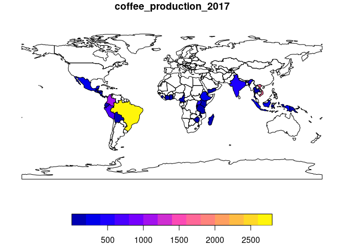<!-- -->

``` r
coffee_world = left_join(coffee_data, world)
```

    ## Joining, by = "name_long"

``` r
coffee_world
```

    ## # A tibble: 47 x 13
    ##    name_long     coffee_production… coffee_productio… iso_a2 continent region_un
    ##    <chr>                      <int>             <int> <chr>  <chr>     <chr>    
    ##  1 Angola                        NA                NA AO     Africa    Africa   
    ##  2 Bolivia                        3                 4 BO     South Am… Americas 
    ##  3 Brazil                      3277              2786 BR     South Am… Americas 
    ##  4 Burundi                       37                38 BI     Africa    Africa   
    ##  5 Cameroon                       8                 6 CM     Africa    Africa   
    ##  6 Central Afri…                 NA                NA CF     Africa    Africa   
    ##  7 Congo, Dem. …                  4                12 <NA>   <NA>      <NA>     
    ##  8 Colombia                    1330              1169 CO     South Am… Americas 
    ##  9 Costa Rica                    28                32 CR     North Am… Americas 
    ## 10 Côte d'Ivoire                114               130 CI     Africa    Africa   
    ## # … with 37 more rows, and 7 more variables: subregion <chr>, type <chr>,
    ## #   area_km2 <dbl>, pop <dbl>, lifeExp <dbl>, gdpPercap <dbl>,
    ## #   geom <MULTIPOLYGON [°]>

``` r
plot(coffee_world["coffee_production_2017"])
```

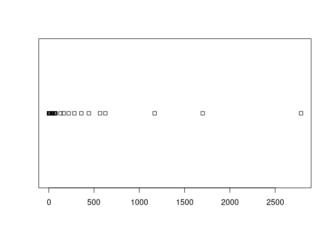<!-- -->

``` r
world_coffee_inner = inner_join(world, coffee_data) #left_joinしつつNA項を削る
```

    ## Joining, by = "name_long"

``` r
world_coffee_inner
```

    ## Simple feature collection with 45 features and 12 fields
    ## Geometry type: MULTIPOLYGON
    ## Dimension:     XY
    ## Bounding box:  xmin: -117.1278 ymin: -33.76838 xmax: 156.02 ymax: 35.49401
    ## Geodetic CRS:  WGS 84
    ## # A tibble: 45 x 13
    ##    iso_a2 name_long  continent region_un subregion type  area_km2    pop lifeExp
    ##    <chr>  <chr>      <chr>     <chr>     <chr>     <chr>    <dbl>  <dbl>   <dbl>
    ##  1 TZ     Tanzania   Africa    Africa    Eastern … Sove…  932746. 5.22e7    64.2
    ##  2 PG     Papua New… Oceania   Oceania   Melanesia Sove…  464520. 7.76e6    65.2
    ##  3 ID     Indonesia  Asia      Asia      South-Ea… Sove… 1819251. 2.55e8    68.9
    ##  4 KE     Kenya      Africa    Africa    Eastern … Sove…  590837. 4.60e7    66.2
    ##  5 DO     Dominican… North Am… Americas  Caribbean Sove…   48158. 1.04e7    73.5
    ##  6 TL     Timor-Les… Asia      Asia      South-Ea… Sove…   14715. 1.21e6    68.3
    ##  7 MX     Mexico     North Am… Americas  Central … Sove… 1969480. 1.24e8    76.8
    ##  8 BR     Brazil     South Am… Americas  South Am… Sove… 8508557. 2.04e8    75.0
    ##  9 BO     Bolivia    South Am… Americas  South Am… Sove… 1085270. 1.06e7    68.4
    ## 10 PE     Peru       South Am… Americas  South Am… Sove… 1309700. 3.10e7    74.5
    ## # … with 35 more rows, and 4 more variables: gdpPercap <dbl>,
    ## #   geom <MULTIPOLYGON [°]>, coffee_production_2016 <int>,
    ## #   coffee_production_2017 <int>

``` r
plot(world_coffee_inner["coffee_production_2017"])
```

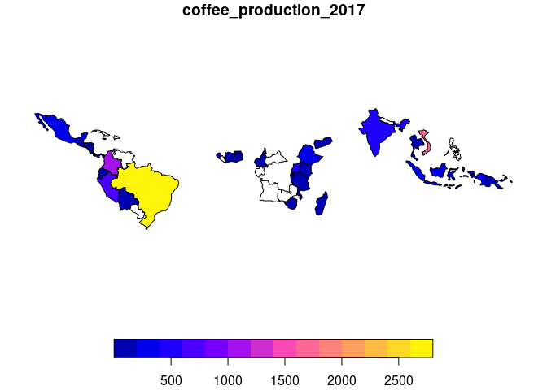<!-- -->

``` r
world_new = world # do not overwrite our original data
world_new$pop_dens = world_new$pop / world_new$area_km2 #列の追加
world_new
```

    ## Simple feature collection with 177 features and 11 fields
    ## Geometry type: MULTIPOLYGON
    ## Dimension:     XY
    ## Bounding box:  xmin: -180 ymin: -90 xmax: 180 ymax: 83.64513
    ## Geodetic CRS:  WGS 84
    ## # A tibble: 177 x 12
    ##    iso_a2 name_long continent region_un subregion type  area_km2     pop lifeExp
    ##  * <chr>  <chr>     <chr>     <chr>     <chr>     <chr>    <dbl>   <dbl>   <dbl>
    ##  1 FJ     Fiji      Oceania   Oceania   Melanesia Sove…   1.93e4  8.86e5    70.0
    ##  2 TZ     Tanzania  Africa    Africa    Eastern … Sove…   9.33e5  5.22e7    64.2
    ##  3 EH     Western … Africa    Africa    Northern… Inde…   9.63e4 NA         NA  
    ##  4 CA     Canada    North Am… Americas  Northern… Sove…   1.00e7  3.55e7    82.0
    ##  5 US     United S… North Am… Americas  Northern… Coun…   9.51e6  3.19e8    78.8
    ##  6 KZ     Kazakhst… Asia      Asia      Central … Sove…   2.73e6  1.73e7    71.6
    ##  7 UZ     Uzbekist… Asia      Asia      Central … Sove…   4.61e5  3.08e7    71.0
    ##  8 PG     Papua Ne… Oceania   Oceania   Melanesia Sove…   4.65e5  7.76e6    65.2
    ##  9 ID     Indonesia Asia      Asia      South-Ea… Sove…   1.82e6  2.55e8    68.9
    ## 10 AR     Argentina South Am… Americas  South Am… Sove…   2.78e6  4.30e7    76.3
    ## # … with 167 more rows, and 3 more variables: gdpPercap <dbl>,
    ## #   geom <MULTIPOLYGON [°]>, pop_dens <dbl>

``` r
world %>% 
  mutate(pop_dens = pop / area_km2) #格納してないのでworldデータ自体は変わっていない
```

    ## Simple feature collection with 177 features and 11 fields
    ## Geometry type: MULTIPOLYGON
    ## Dimension:     XY
    ## Bounding box:  xmin: -180 ymin: -90 xmax: 180 ymax: 83.64513
    ## Geodetic CRS:  WGS 84
    ## # A tibble: 177 x 12
    ##    iso_a2 name_long continent region_un subregion type  area_km2     pop lifeExp
    ##  * <chr>  <chr>     <chr>     <chr>     <chr>     <chr>    <dbl>   <dbl>   <dbl>
    ##  1 FJ     Fiji      Oceania   Oceania   Melanesia Sove…   1.93e4  8.86e5    70.0
    ##  2 TZ     Tanzania  Africa    Africa    Eastern … Sove…   9.33e5  5.22e7    64.2
    ##  3 EH     Western … Africa    Africa    Northern… Inde…   9.63e4 NA         NA  
    ##  4 CA     Canada    North Am… Americas  Northern… Sove…   1.00e7  3.55e7    82.0
    ##  5 US     United S… North Am… Americas  Northern… Coun…   9.51e6  3.19e8    78.8
    ##  6 KZ     Kazakhst… Asia      Asia      Central … Sove…   2.73e6  1.73e7    71.6
    ##  7 UZ     Uzbekist… Asia      Asia      Central … Sove…   4.61e5  3.08e7    71.0
    ##  8 PG     Papua Ne… Oceania   Oceania   Melanesia Sove…   4.65e5  7.76e6    65.2
    ##  9 ID     Indonesia Asia      Asia      South-Ea… Sove…   1.82e6  2.55e8    68.9
    ## 10 AR     Argentina South Am… Americas  South Am… Sove…   2.78e6  4.30e7    76.3
    ## # … with 167 more rows, and 3 more variables: gdpPercap <dbl>,
    ## #   geom <MULTIPOLYGON [°]>, pop_dens <dbl>

``` r
world %>% transmute(pop_dens = pop / area_km2) %>% plot() #pop_densのみにする(sfクラスなのでgeomは残る)
```

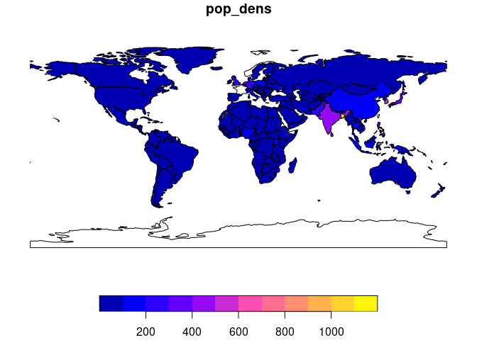<!-- -->

``` r
elev = raster(nrows = 6, ncols = 6, res = 0.5,
              xmn = -1.5, xmx = 1.5, ymn = -1.5, ymx = 1.5,
              vals = 1:36) #左から右、その後下の行
plot(elev)
```

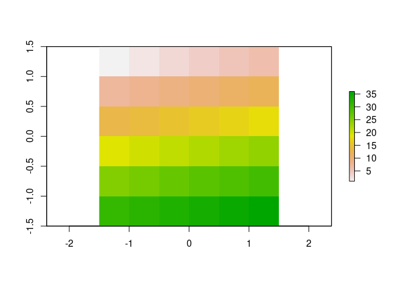<!-- -->

``` r
grain_order = c("clay", "silt", "sand")
grain_char = sample(grain_order, 36, replace = TRUE) #36個にランダムに3つをあてがう
grain_fact = factor(grain_char, levels = grain_order) #rasterが扱えるようにしてる
grain = raster(nrows = 6, ncols = 6, res = 0.5, 
               xmn = -1.5, xmx = 1.5, ymn = -1.5, ymx = 1.5,
               vals = grain_fact)
plot(grain)
```

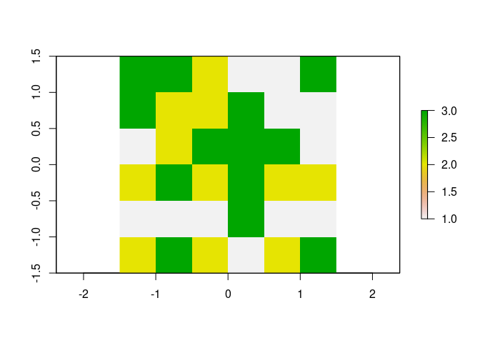<!-- -->

``` r
elev[1,1]
```

    ## [1] 1

``` r
elev[1]
```

    ## [1] 1

``` r
r_stack = stack(elev, grain) #データのスタック
names(r_stack) = c("elev", "grain")
# three ways to extract a layer of a stack
raster::subset(r_stack, "elev")
```

    ## class      : RasterLayer 
    ## dimensions : 6, 6, 36  (nrow, ncol, ncell)
    ## resolution : 0.5, 0.5  (x, y)
    ## extent     : -1.5, 1.5, -1.5, 1.5  (xmin, xmax, ymin, ymax)
    ## crs        : +proj=longlat +datum=WGS84 +no_defs 
    ## source     : memory
    ## names      : elev 
    ## values     : 1, 36  (min, max)

``` r
r_stack[["elev"]]
```

    ## class      : RasterLayer 
    ## dimensions : 6, 6, 36  (nrow, ncol, ncell)
    ## resolution : 0.5, 0.5  (x, y)
    ## extent     : -1.5, 1.5, -1.5, 1.5  (xmin, xmax, ymin, ymax)
    ## crs        : +proj=longlat +datum=WGS84 +no_defs 
    ## source     : memory
    ## names      : elev 
    ## values     : 1, 36  (min, max)

``` r
r_stack$elev
```

    ## class      : RasterLayer 
    ## dimensions : 6, 6, 36  (nrow, ncol, ncell)
    ## resolution : 0.5, 0.5  (x, y)
    ## extent     : -1.5, 1.5, -1.5, 1.5  (xmin, xmax, ymin, ymax)
    ## crs        : +proj=longlat +datum=WGS84 +no_defs 
    ## source     : memory
    ## names      : elev 
    ## values     : 1, 36  (min, max)

``` r
elev[]
```

    ##  [1]  1  2  3  4  5  6  7  8  9 10 11 12 13 14 15 16 17 18 19 20 21 22 23 24 25
    ## [26] 26 27 28 29 30 31 32 33 34 35 36

``` r
elev[1, 1:2] = 0

cellStats(elev, sd)
```

    ## [1] 10.67808

``` r
hist(elev)
```

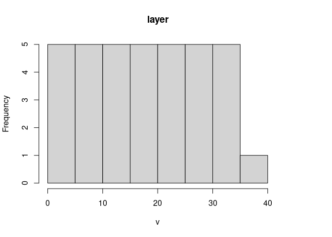<!-- -->

# chapter 4

``` r
library(sf)
library(raster)
library(dplyr)
library(spData)
```

``` r
nz
```

    ## Simple feature collection with 16 features and 6 fields
    ## Geometry type: MULTIPOLYGON
    ## Dimension:     XY
    ## Bounding box:  xmin: 1090144 ymin: 4748537 xmax: 2089533 ymax: 6191874
    ## Projected CRS: NZGD2000 / New Zealand Transverse Mercator 2000
    ## First 10 features:
    ##                 Name Island Land_area Population Median_income Sex_ratio
    ## 1          Northland  North 12500.561     175500         23400 0.9424532
    ## 2           Auckland  North  4941.573    1657200         29600 0.9442858
    ## 3            Waikato  North 23900.036     460100         27900 0.9520500
    ## 4      Bay of Plenty  North 12071.145     299900         26200 0.9280391
    ## 5           Gisborne  North  8385.827      48500         24400 0.9349734
    ## 6        Hawke's Bay  North 14137.524     164000         26100 0.9238375
    ## 7           Taranaki  North  7254.480     118000         29100 0.9569363
    ## 8  Manawatu-Wanganui  North 22220.608     234500         25000 0.9387734
    ## 9         Wellington  North  8048.553     513900         32700 0.9335524
    ## 10        West Coast  South 23245.456      32400         26900 1.0139072
    ##                              geom
    ## 1  MULTIPOLYGON (((1745493 600...
    ## 2  MULTIPOLYGON (((1803822 590...
    ## 3  MULTIPOLYGON (((1860345 585...
    ## 4  MULTIPOLYGON (((2049387 583...
    ## 5  MULTIPOLYGON (((2024489 567...
    ## 6  MULTIPOLYGON (((2024489 567...
    ## 7  MULTIPOLYGON (((1740438 571...
    ## 8  MULTIPOLYGON (((1866732 566...
    ## 9  MULTIPOLYGON (((1881590 548...
    ## 10 MULTIPOLYGON (((1557042 531...

``` r
canterbury = nz %>% filter(Name == "Canterbury")
canterbury_height = nz_height[canterbury, ]
plot(canterbury_height)
```

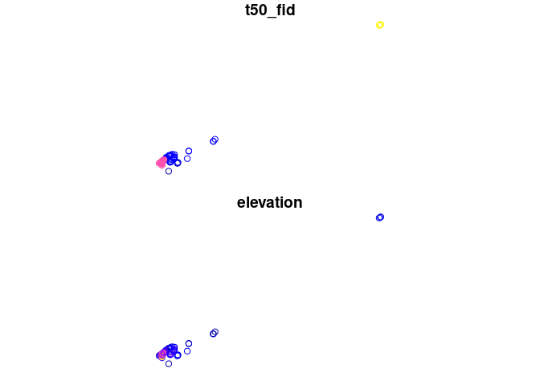<!-- -->

``` r
library(tmap)
p_hpnz1 = tm_shape(nz) + tm_polygons(col = "white") +
  tm_shape(nz_height) + tm_symbols(shape = 2, col = "red", size = 0.25) +
  tm_layout(main.title = "High points in New Zealand", main.title.size = 1,
            bg.color = "lightblue")
p_hpnz2 = tm_shape(nz) + tm_polygons(col = "white") +
  tm_shape(canterbury) + tm_fill(col = "gray") + 
  tm_shape(canterbury_height) + tm_symbols(shape = 2, col = "red", size = 0.25) +
  tm_layout(main.title = "High points in Canterbury", main.title.size = 1,
            bg.color = "lightblue")
tmap_arrange(p_hpnz1, p_hpnz2, ncol = 2)
```

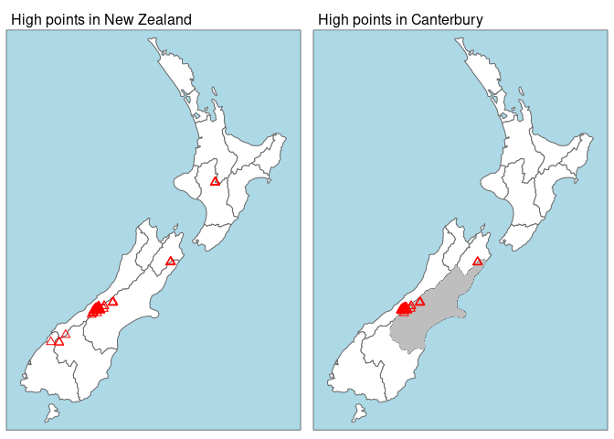<!-- -->

``` r
sel_sgbp = st_intersects(x = nz_height, y = canterbury)
class(sel_sgbp)
```

    ## [1] "sgbp" "list"

``` r
sel_logical = lengths(sel_sgbp) > 0
canterbury_height2 = nz_height[sel_logical, ]

a_poly = st_polygon(list(rbind(c(-1, -1), c(1, -1), c(1, 1), c(-1, -1))))
a = st_sfc(a_poly)
# create a line
l_line = st_linestring(x = matrix(c(-1, -1, -0.5, 1), ncol = 2))
l = st_sfc(l_line)
# create points
p_matrix = matrix(c(0.5, 1, -1, 0, 0, 1, 0.5, 1), ncol = 2)
p_multi = st_multipoint(x = p_matrix)
p = st_cast(st_sfc(p_multi), "POINT")

par(pty = "s")
plot(a, border = "red", col = "gray", axes = TRUE)
plot(l, add = TRUE)
plot(p, add = TRUE, lab = 1:4)
text(p_matrix[, 1] + 0.04, p_matrix[, 2] - 0.06, 1:4, cex = 1.3)
```

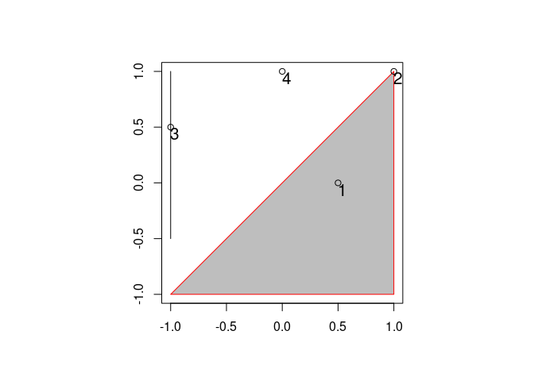<!-- -->

``` r
sel = st_is_within_distance(p, a, dist = 0.9) # can only return a sparse matrix
lengths(sel) > 0
```

    ## [1]  TRUE  TRUE FALSE  TRUE

``` r
set.seed(2018) # set seed for reproducibility
(bb_world = st_bbox(world)) # the world's bounds(世界の範囲)
```

    ##       xmin       ymin       xmax       ymax 
    ## -180.00000  -90.00000  180.00000   83.64513

``` r
random_df = tibble(
  x = runif(n = 10, min = bb_world[1], max = bb_world[3]),
  y = runif(n = 10, min = bb_world[2], max = bb_world[4])
) #世界の範囲内でランダム点10個
random_points = random_df %>% 
  st_as_sf(coords = c("x", "y")) %>% # set coordinates
  st_set_crs(4326) # set geographic CRS

world_random = world[random_points, ] #random_pointsを国土内(geom)に含む国が出てくる(4/10)
```

    ## although coordinates are longitude/latitude, st_intersects assumes that they are planar

``` r
nrow(world_random)
```

    ## [1] 4

``` r
random_joined = st_join(random_points, world["name_long"])
```

    ## although coordinates are longitude/latitude, st_intersects assumes that they are planar
    ## although coordinates are longitude/latitude, st_intersects assumes that they are planar

``` r
plot(random_joined)
```

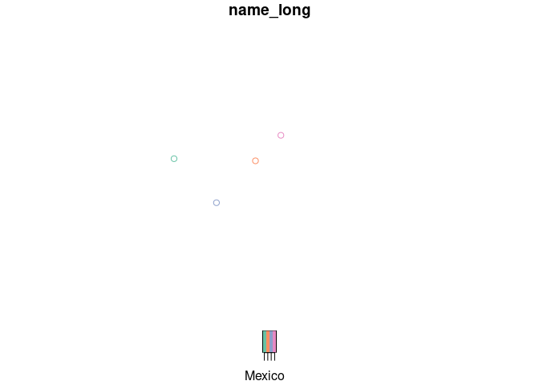<!-- -->

``` r
plot(st_geometry(cycle_hire), col = "blue")
plot(st_geometry(cycle_hire_osm), add = TRUE, pch = 3, col = "red")
```

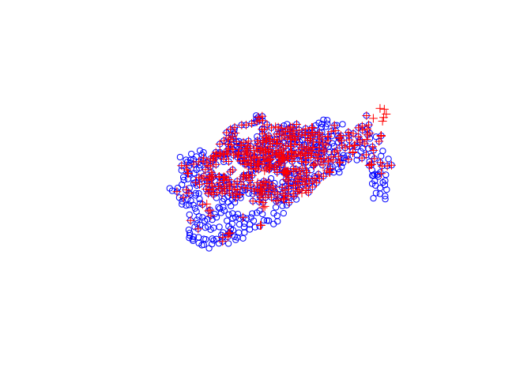<!-- -->

``` r
cycle_hire_P = st_transform(cycle_hire, 27700) #座標系を27700系に移す
cycle_hire_osm_P = st_transform(cycle_hire_osm, 27700)
sel = st_is_within_distance(cycle_hire_P, cycle_hire_osm_P, dist = 20) #hireとhire_osmで距離20m以内ならselに入れる
summary(lengths(sel) > 0)
```

    ##    Mode   FALSE    TRUE 
    ## logical     304     438

``` r
z = st_join(cycle_hire_P, cycle_hire_osm_P,
            join = st_is_within_distance, dist = 20)
nrow(cycle_hire)
```

    ## [1] 742

``` r
plot(cycle_hire)
```

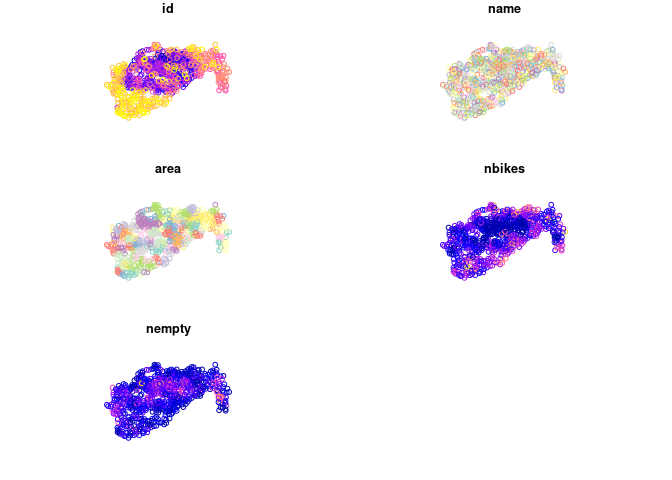<!-- -->

``` r
nrow(z)
```

    ## [1] 762

``` r
z
```

    ## Simple feature collection with 762 features and 10 fields
    ## Geometry type: POINT
    ## Dimension:     XY
    ## Bounding box:  xmin: 522502 ymin: 174408 xmax: 538733.2 ymax: 184421
    ## Projected CRS: OSGB 1936 / British National Grid
    ## First 10 features:
    ##    id             name.x             area nbikes nempty    osm_id
    ## 1   1       River Street      Clerkenwell      4     14 869697014
    ## 2   2 Phillimore Gardens       Kensington      2     34 885331201
    ## 3   3 Christopher Street Liverpool Street      0     32 920087626
    ## 4   4  St. Chad's Street     King's Cross      4     19 781506147
    ## 5   5     Sedding Street    Sloane Square     15     12      <NA>
    ## 6   6 Broadcasting House       Marylebone      0     18 839403852
    ## 7   7   Charlbert Street  St. John's Wood     15      0 839403885
    ## 8   8         Lodge Road  St. John's Wood      5     13 839403863
    ## 9   9     New Globe Walk         Bankside      3     16 835264541
    ## 10 10        Park Street         Bankside      1     17 848525385
    ##                            name.y capacity cyclestreets_id description
    ## 1                    River Street        9            <NA>        <NA>
    ## 2  Kensington, Phillimore Gardens       27            <NA>        <NA>
    ## 3              Christopher Street       NA            <NA>        <NA>
    ## 4                            <NA>       NA            <NA>        <NA>
    ## 5                            <NA>       NA            <NA>        <NA>
    ## 6              Broadcasting House        8            <NA>        <NA>
    ## 7                Charlbert Street        2            <NA>        <NA>
    ## 8                      Lodge Road        8            <NA>        <NA>
    ## 9        New Globe Walk, Bankside        9            <NA>        <NA>
    ## 10                    Park Street        8            <NA>        <NA>
    ##                     geometry
    ## 1  POINT (531203.5 182832.1)
    ## 2  POINT (525208.1 179391.9)
    ## 3  POINT (532985.8 182001.6)
    ## 4    POINT (530437.8 182912)
    ## 5      POINT (528051 178742)
    ## 6  POINT (528858.4 181542.9)
    ## 7    POINT (527159 183300.8)
    ## 8  POINT (527032.7 182634.6)
    ## 9    POINT (532205 180434.6)
    ## 10 POINT (532464.9 180284.3)

``` r
plot(nz)
```

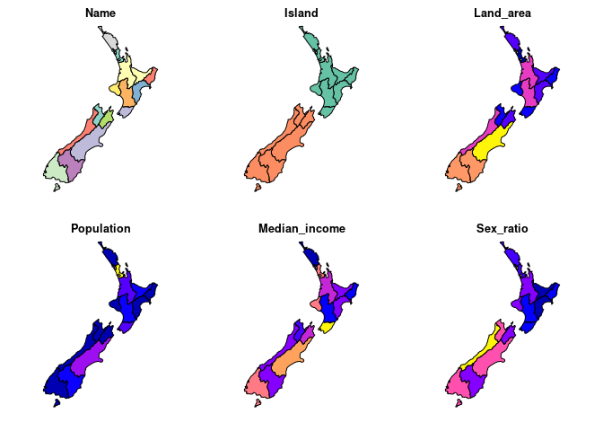<!-- -->

``` r
plot(nz_height)
```

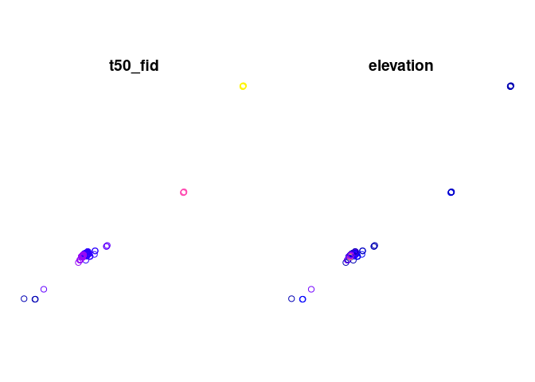<!-- -->

``` r
nz_avheight = aggregate(x = nz_height, by = nz, FUN = mean) #FUNの引数を変えることで様々な関数になる

library(tmap)
tm_shape(nz_avheight) +
  tm_fill("elevation", breaks = seq(27, 30, by = 0.5) * 1e2) +
  tm_borders()
```

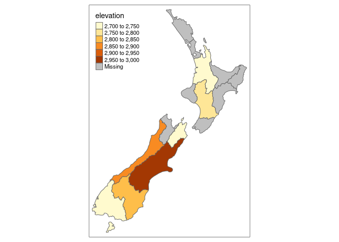<!-- -->

``` r
plot(elev)
```

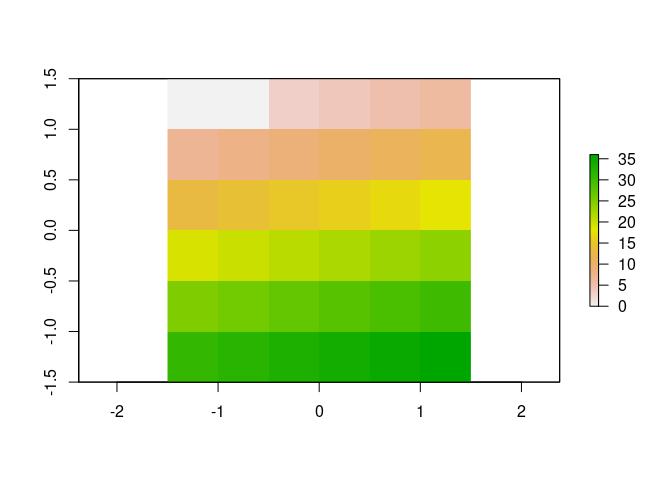<!-- -->

``` r
id = cellFromXY(elev, xy = c(0.1, 0.1)) #xyが(0.1,0.1)のインデックスをとる
elev[id]
```

    ## [1] 16

``` r
# the same as
raster::extract(elev, data.frame(x = 0.1, y = 0.1))
```

    ## [1] 16

``` r
clip = raster(xmn = 0.9, xmx = 1.8, ymn = -0.45, ymx = 0.45,
              res = 0.3, vals = rep(1, 9))
plot(clip)
```

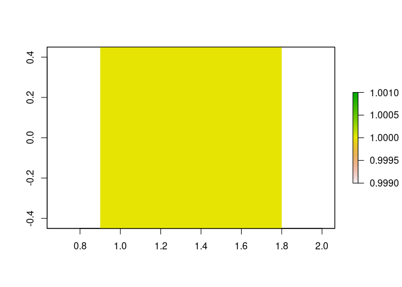<!-- -->

``` r
elev[clip]
```

    ## [1] 18 24

``` r
# create raster mask
rmask = elev 
values(rmask) = sample(c(NA, TRUE), 36, replace = TRUE)
plot(rmask)
```

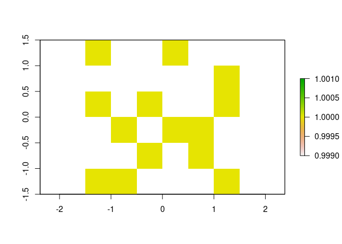<!-- -->

``` r
# spatial subsetting
elev[rmask, drop = FALSE]           # with [ operator
```

    ## class      : RasterLayer 
    ## dimensions : 6, 6, 36  (nrow, ncol, ncell)
    ## resolution : 0.5, 0.5  (x, y)
    ## extent     : -1.5, 1.5, -1.5, 1.5  (xmin, xmax, ymin, ymax)
    ## crs        : +proj=longlat +datum=WGS84 +no_defs 
    ## source     : memory
    ## names      : layer 
    ## values     : 0, 36  (min, max)

``` r
mask(elev, rmask)                   # with mask()
```

    ## class      : RasterLayer 
    ## dimensions : 6, 6, 36  (nrow, ncol, ncell)
    ## resolution : 0.5, 0.5  (x, y)
    ## extent     : -1.5, 1.5, -1.5, 1.5  (xmin, xmax, ymin, ymax)
    ## crs        : +proj=longlat +datum=WGS84 +no_defs 
    ## source     : memory
    ## names      : layer 
    ## values     : 0, 36  (min, max)

``` r
overlay(elev, rmask, fun = "max")   # with overlay
```

    ## class      : RasterLayer 
    ## dimensions : 6, 6, 36  (nrow, ncol, ncell)
    ## resolution : 0.5, 0.5  (x, y)
    ## extent     : -1.5, 1.5, -1.5, 1.5  (xmin, xmax, ymin, ymax)
    ## crs        : +proj=longlat +datum=WGS84 +no_defs 
    ## source     : memory
    ## names      : layer 
    ## values     : 1, 36  (min, max)

``` r
elev + elev #セルサイズが同じなら演算が可能
```

    ## class      : RasterLayer 
    ## dimensions : 6, 6, 36  (nrow, ncol, ncell)
    ## resolution : 0.5, 0.5  (x, y)
    ## extent     : -1.5, 1.5, -1.5, 1.5  (xmin, xmax, ymin, ymax)
    ## crs        : +proj=longlat +datum=WGS84 +no_defs 
    ## source     : memory
    ## names      : layer 
    ## values     : 0, 72  (min, max)

``` r
elev^2
```

    ## class      : RasterLayer 
    ## dimensions : 6, 6, 36  (nrow, ncol, ncell)
    ## resolution : 0.5, 0.5  (x, y)
    ## extent     : -1.5, 1.5, -1.5, 1.5  (xmin, xmax, ymin, ymax)
    ## crs        : +proj=longlat +datum=WGS84 +no_defs 
    ## source     : memory
    ## names      : layer 
    ## values     : 0, 1296  (min, max)

``` r
log(elev)
```

    ## class      : RasterLayer 
    ## dimensions : 6, 6, 36  (nrow, ncol, ncell)
    ## resolution : 0.5, 0.5  (x, y)
    ## extent     : -1.5, 1.5, -1.5, 1.5  (xmin, xmax, ymin, ymax)
    ## crs        : +proj=longlat +datum=WGS84 +no_defs 
    ## source     : memory
    ## names      : layer 
    ## values     : -Inf, 3.583519  (min, max)

``` r
elev > 5
```

    ## class      : RasterLayer 
    ## dimensions : 6, 6, 36  (nrow, ncol, ncell)
    ## resolution : 0.5, 0.5  (x, y)
    ## extent     : -1.5, 1.5, -1.5, 1.5  (xmin, xmax, ymin, ymax)
    ## crs        : +proj=longlat +datum=WGS84 +no_defs 
    ## source     : memory
    ## names      : layer 
    ## values     : 0, 1  (min, max)

# chapter 5

``` r
library(sf)
library(raster)
library(dplyr)
library(spData)
library(spDataLarge)
```

    ## 
    ## Attaching package: 'spDataLarge'

    ## The following object is masked _by_ '.GlobalEnv':
    ## 
    ##     random_points

``` r
us_states
```

    ## Simple feature collection with 49 features and 6 fields
    ## Geometry type: MULTIPOLYGON
    ## Dimension:     XY
    ## Bounding box:  xmin: -124.7042 ymin: 24.55868 xmax: -66.9824 ymax: 49.38436
    ## Geodetic CRS:  NAD83
    ## First 10 features:
    ##    GEOID        NAME   REGION             AREA total_pop_10 total_pop_15
    ## 1     01     Alabama    South 133709.27 [km^2]      4712651      4830620
    ## 2     04     Arizona     West 295281.25 [km^2]      6246816      6641928
    ## 3     08    Colorado     West 269573.06 [km^2]      4887061      5278906
    ## 4     09 Connecticut Norteast  12976.59 [km^2]      3545837      3593222
    ## 5     12     Florida    South 151052.01 [km^2]     18511620     19645772
    ## 6     13     Georgia    South 152725.21 [km^2]      9468815     10006693
    ## 7     16       Idaho     West 216512.66 [km^2]      1526797      1616547
    ## 8     18     Indiana  Midwest  93648.40 [km^2]      6417398      6568645
    ## 9     20      Kansas  Midwest 213037.08 [km^2]      2809329      2892987
    ## 10    22   Louisiana    South 122345.76 [km^2]      4429940      4625253
    ##                          geometry
    ## 1  MULTIPOLYGON (((-88.20006 3...
    ## 2  MULTIPOLYGON (((-114.7196 3...
    ## 3  MULTIPOLYGON (((-109.0501 4...
    ## 4  MULTIPOLYGON (((-73.48731 4...
    ## 5  MULTIPOLYGON (((-81.81169 2...
    ## 6  MULTIPOLYGON (((-85.60516 3...
    ## 7  MULTIPOLYGON (((-116.916 45...
    ## 8  MULTIPOLYGON (((-87.52404 4...
    ## 9  MULTIPOLYGON (((-102.0517 4...
    ## 10 MULTIPOLYGON (((-92.01783 2...

``` r
plot(us_states)
```

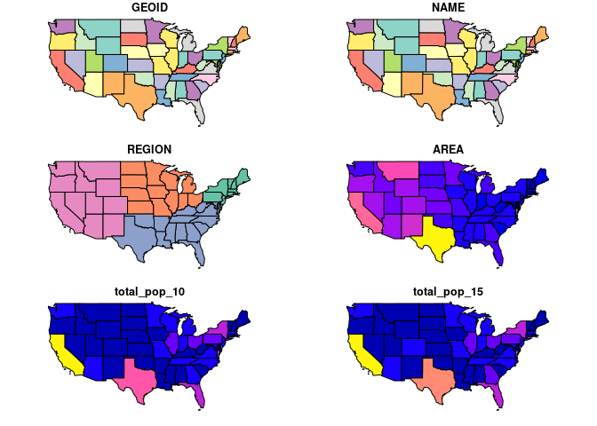<!-- -->

``` r
regions = aggregate(x = us_states[, "total_pop_15"], by = list(us_states$REGION),
                    FUN = sum, na.rm = TRUE)
plot(regions)
```

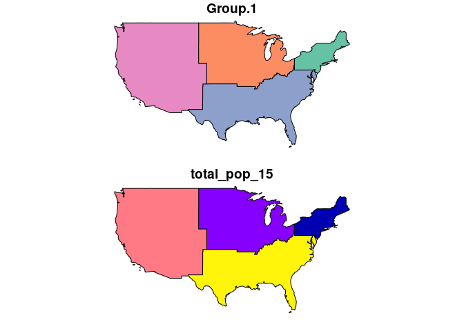<!-- -->

``` r
regions2 = us_states %>% group_by(REGION) %>%
  summarize(pop = sum(total_pop_15, na.rm = TRUE))
```

    ## although coordinates are longitude/latitude, st_union assumes that they are planar
    ## although coordinates are longitude/latitude, st_union assumes that they are planar
    ## although coordinates are longitude/latitude, st_union assumes that they are planar
    ## although coordinates are longitude/latitude, st_union assumes that they are planar

``` r
us_west = us_states[us_states$REGION == "West", ]
us_west_union = st_union(us_west) #unionは中身を消してgeomのみにする?
```

    ## although coordinates are longitude/latitude, st_union assumes that they are planar

``` r
plot(us_west)
```

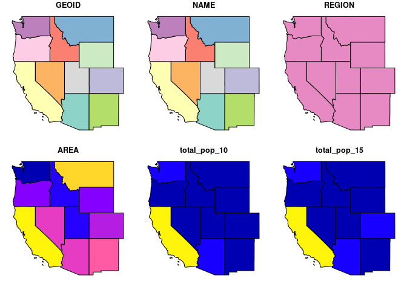<!-- -->

``` r
plot(us_west_union)
```

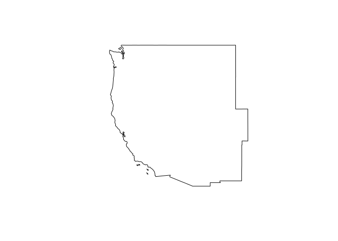<!-- -->

``` r
data("dem", package = "spDataLarge")
plot(dem)
```

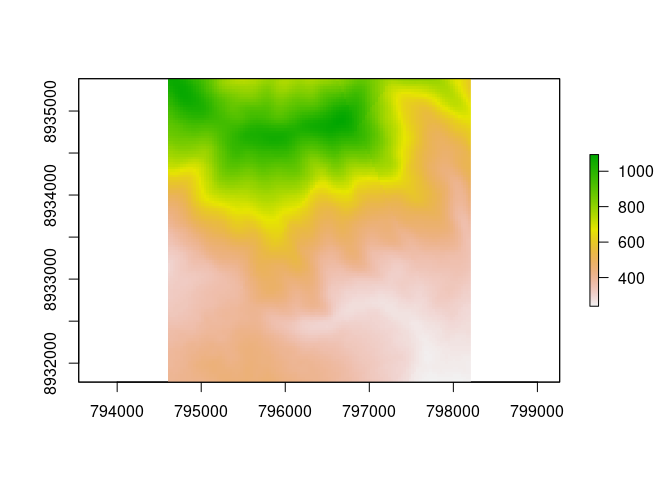<!-- -->

``` r
dem
```

    ## class      : RasterLayer 
    ## dimensions : 117, 117, 13689  (nrow, ncol, ncell)
    ## resolution : 30.85, 30.85  (x, y)
    ## extent     : 794599.1, 798208.6, 8931775, 8935384  (xmin, xmax, ymin, ymax)
    ## crs        : +proj=utm +zone=17 +south +ellps=WGS84 +towgs84=0,0,0,0,0,0,0 +units=m +no_defs 
    ## source     : memory
    ## names      : dem 
    ## values     : 238, 1094  (min, max)

``` r
dem_agg = aggregate(dem, fact = 5, fun = mean) #解像度を下げる(1/5)
plot(dem_agg)
```

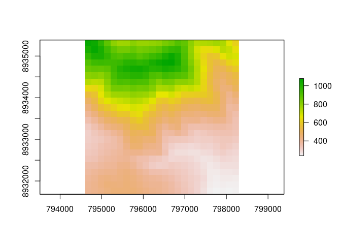<!-- -->

``` r
dem_agg
```

    ## class      : RasterLayer 
    ## dimensions : 24, 24, 576  (nrow, ncol, ncell)
    ## resolution : 154.25, 154.25  (x, y)
    ## extent     : 794599.1, 798301.1, 8931682, 8935384  (xmin, xmax, ymin, ymax)
    ## crs        : +proj=utm +zone=17 +south +ellps=WGS84 +towgs84=0,0,0,0,0,0,0 +units=m +no_defs 
    ## source     : memory
    ## names      : dem 
    ## values     : 239.9, 1077.6  (min, max)

``` r
dem_disagg = disaggregate(dem_agg, fact = 5, method = "bilinear") #解像度を上げる(5倍)
plot(dem_disagg)
```

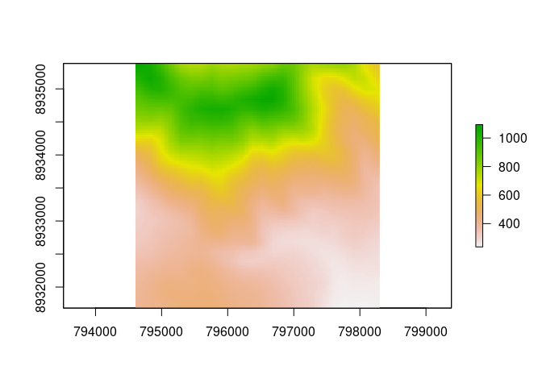<!-- -->

``` r
identical(dem, dem_disagg) #完全には戻らない
```

    ## [1] FALSE

``` r
srtm = raster(system.file("raster/srtm.tif", package = "spDataLarge")) #標高データ
zion = st_read(system.file("vector/zion.gpkg", package = "spDataLarge")) #zionという場所(srtmが示している場所)のデータ
```

    ## Reading layer `zion' from data source `/usr/local/lib/R/site-library/spDataLarge/vector/zion.gpkg' using driver `GPKG'
    ## Simple feature collection with 1 feature and 11 fields
    ## Geometry type: POLYGON
    ## Dimension:     XY
    ## Bounding box:  xmin: 302903.1 ymin: 4112244 xmax: 334735.5 ymax: 4153087
    ## Projected CRS: UTM Zone 12, Northern Hemisphere

``` r
zion = st_transform(zion, projection(srtm)) #2つのデータで座標系を統一
plot(srtm)
```

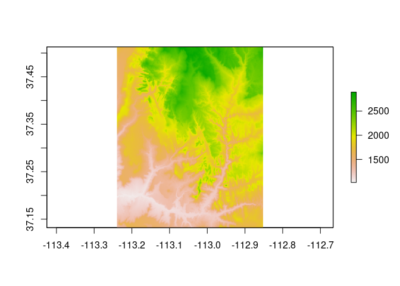<!-- -->

``` r
plot(zion)
```

    ## Warning: plotting the first 10 out of 11 attributes; use max.plot = 11 to plot
    ## all

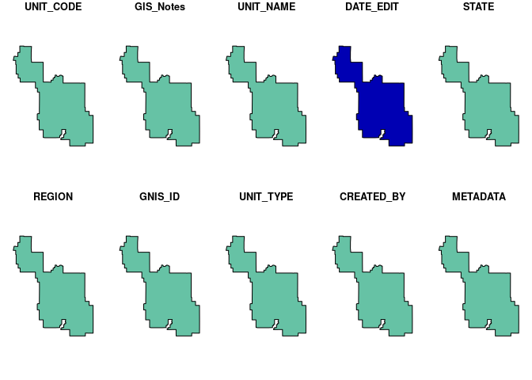<!-- -->

``` r
srtm_cropped = crop(srtm, zion) #zionの地形全体を含む長方形でsrtmをクロップしている
plot(srtm_cropped)
```

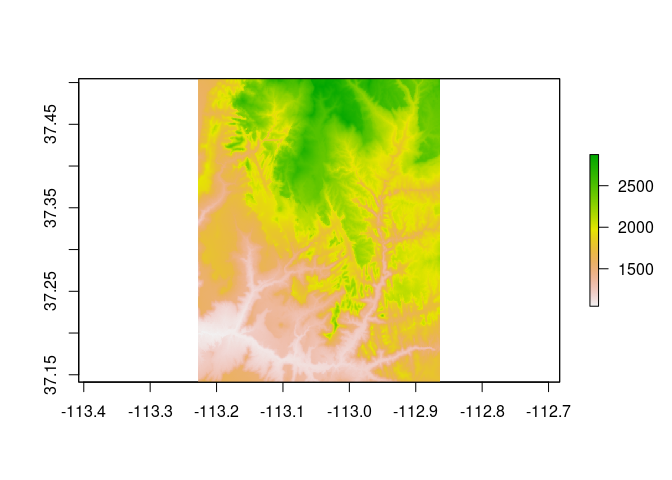<!-- -->

``` r
srtm_masked = mask(srtm, zion) #zionの形に沿ってクロップ(マスク)
plot(srtm_masked)
```

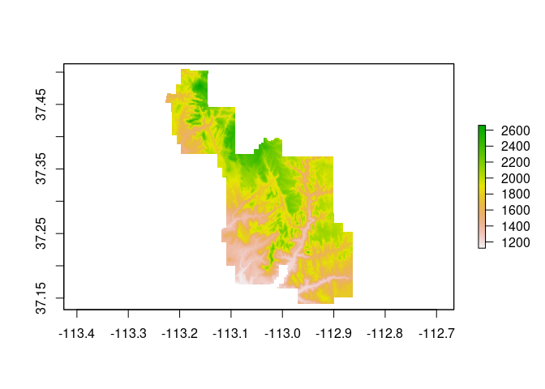<!-- -->

``` r
data("zion_points", package = "spDataLarge")
zion_points$elevation = raster::extract(srtm, zion_points)
#raster::extract(srtm, zion_points, buffer = 1000) #バッファ込み.めちゃ重い

zion_nlcd = raster::extract(nlcd, zion, df = TRUE, factors = TRUE) 
```

    ## Warning in .local(x, y, ...): Transforming SpatialPolygons to the CRS of the
    ## Raster

    ## Warning in spTransform(xSP, CRSobj, ...): NULL target CRS comment, falling back
    ## to PROJ string

``` r
dplyr::select(zion_nlcd, ID, levels) %>% 
  tidyr::gather(key, value, -ID) %>%
  group_by(ID, key, value) %>%
  tally() %>% 
  tidyr::spread(value, n, fill = 0)
```

    ## # A tibble: 1 x 9
    ## # Groups:   ID, key [1]
    ##      ID key    Barren Cultivated Developed Forest Herbaceous Shrubland Wetlands
    ##   <dbl> <chr>   <dbl>      <dbl>     <dbl>  <dbl>      <dbl>     <dbl>    <dbl>
    ## 1     1 levels  98285         62      4205 298299        235    203701      679

``` r
cycle_hire_osm_projected = st_transform(cycle_hire_osm, 27700)
raster_template = raster(extent(cycle_hire_osm_projected), resolution = 1000,
                         crs = st_crs(cycle_hire_osm_projected)$proj4string)
```

    ## Warning in showSRID(uprojargs, format = "PROJ", multiline = "NO", prefer_proj
    ## = prefer_proj): Discarded datum Unknown based on Airy 1830 ellipsoid in Proj4
    ## definition

``` r
ch_raster1 = rasterize(cycle_hire_osm_projected, raster_template, field = 1)
```

    ## Warning in showSRID(SRS_string, format = "PROJ", multiline = "NO", prefer_proj =
    ## prefer_proj): Discarded datum OSGB 1936 in Proj4 definition

``` r
plot(ch_raster1)
```

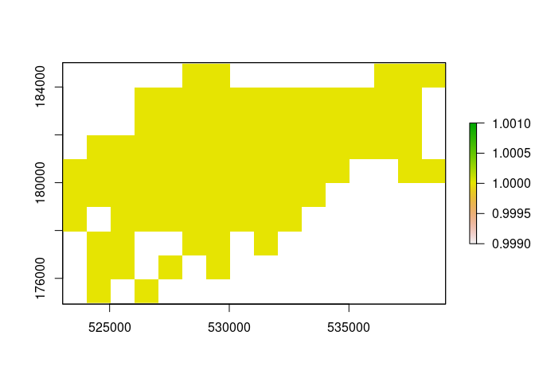<!-- -->

``` r
ch_raster2 = rasterize(cycle_hire_osm_projected, raster_template, 
                       field = 1, fun = "count")
```

    ## Warning in showSRID(SRS_string, format = "PROJ", multiline = "NO", prefer_proj =
    ## prefer_proj): Discarded datum OSGB 1936 in Proj4 definition

``` r
plot(ch_raster2)
```

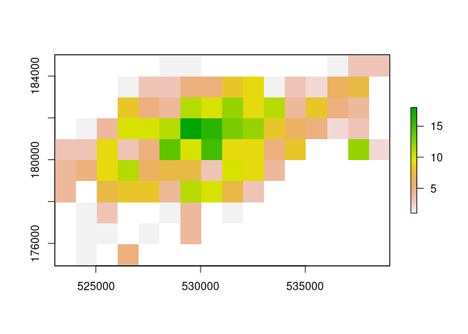<!-- -->

``` r
ch_raster3 = rasterize(cycle_hire_osm_projected, raster_template, 
                       field = "capacity", fun = sum)
```

    ## Warning in showSRID(SRS_string, format = "PROJ", multiline = "NO", prefer_proj =
    ## prefer_proj): Discarded datum OSGB 1936 in Proj4 definition

``` r
plot(ch_raster3)
```

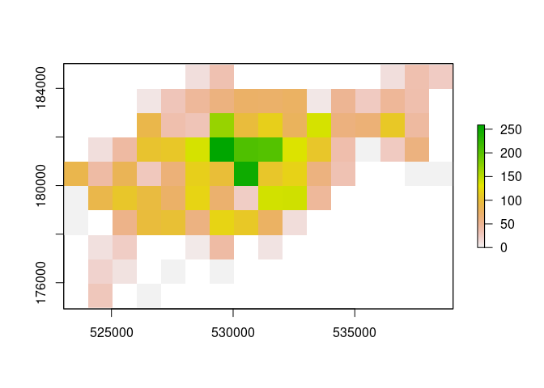<!-- -->
