第９・１０回課題
================
22MM337：星澤知宙
2022/5/23

## R Markdown

# chapter 6

``` r
library(sf)
```

    ## Linking to GEOS 3.8.0, GDAL 3.0.4, PROJ 6.3.1

``` r
library(raster)
```

    ## Loading required package: sp

``` r
library(dplyr)
```

    ## 
    ## Attaching package: 'dplyr'

    ## The following objects are masked from 'package:raster':
    ## 
    ##     intersect, select, union

    ## The following objects are masked from 'package:stats':
    ## 
    ##     filter, lag

    ## The following objects are masked from 'package:base':
    ## 
    ##     intersect, setdiff, setequal, union

``` r
library(spData)
library(spDataLarge)
```

``` r
london = data.frame(lon = -0.1, lat = 51.5) %>% #緯度経度指定
  st_as_sf(coords = c("lon", "lat"))
st_is_longlat(london)
```

    ## [1] NA

``` r
#> [1] NA

london_geo = st_set_crs(london, 4326) #crsを付加(?)
st_is_longlat(london_geo)
```

    ## [1] TRUE

``` r
london_buff_no_crs = st_buffer(london, dist = 1)
london_buff = st_buffer(london_geo, dist = 1)
```

    ## Warning in st_buffer.sfc(st_geometry(x), dist, nQuadSegs, endCapStyle =
    ## endCapStyle, : st_buffer does not correctly buffer longitude/latitude data

    ## dist is assumed to be in decimal degrees (arc_degrees).

``` r
london_proj = data.frame(x = 530000, y = 180000) %>% #m指定
  st_as_sf(coords = 1:2, crs = 27700) #地球の球面を平面のように扱える直交座標系の1つ(今回のはBritish national grid)

st_crs(london_proj)
```

    ## Coordinate Reference System:
    ##   User input: EPSG:27700 
    ##   wkt:
    ## PROJCRS["OSGB 1936 / British National Grid",
    ##     BASEGEOGCRS["OSGB 1936",
    ##         DATUM["OSGB 1936",
    ##             ELLIPSOID["Airy 1830",6377563.396,299.3249646,
    ##                 LENGTHUNIT["metre",1]]],
    ##         PRIMEM["Greenwich",0,
    ##             ANGLEUNIT["degree",0.0174532925199433]],
    ##         ID["EPSG",4277]],
    ##     CONVERSION["British National Grid",
    ##         METHOD["Transverse Mercator",
    ##             ID["EPSG",9807]],
    ##         PARAMETER["Latitude of natural origin",49,
    ##             ANGLEUNIT["degree",0.0174532925199433],
    ##             ID["EPSG",8801]],
    ##         PARAMETER["Longitude of natural origin",-2,
    ##             ANGLEUNIT["degree",0.0174532925199433],
    ##             ID["EPSG",8802]],
    ##         PARAMETER["Scale factor at natural origin",0.9996012717,
    ##             SCALEUNIT["unity",1],
    ##             ID["EPSG",8805]],
    ##         PARAMETER["False easting",400000,
    ##             LENGTHUNIT["metre",1],
    ##             ID["EPSG",8806]],
    ##         PARAMETER["False northing",-100000,
    ##             LENGTHUNIT["metre",1],
    ##             ID["EPSG",8807]]],
    ##     CS[Cartesian,2],
    ##         AXIS["(E)",east,
    ##             ORDER[1],
    ##             LENGTHUNIT["metre",1]],
    ##         AXIS["(N)",north,
    ##             ORDER[2],
    ##             LENGTHUNIT["metre",1]],
    ##     USAGE[
    ##         SCOPE["unknown"],
    ##         AREA["UK - Britain and UKCS 49°46'N to 61°01'N, 7°33'W to 3°33'E"],
    ##         BBOX[49.75,-9.2,61.14,2.88]],
    ##     ID["EPSG",27700]]

``` r
london_proj_buff = st_buffer(london_proj, 111320) #緯度経度を1度=111kmとして換算し、半径1度の円を書く
#緯度経度で半径を設定すると楕円になる。m換算でやると円になる。
```

<div class="figure">

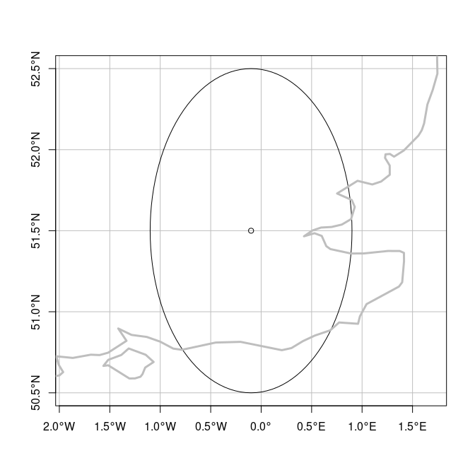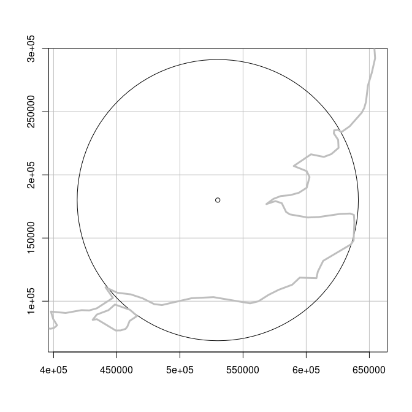
<p class="caption">
Buffers around London with a geographic (left) and projected (right)
CRS. The gray outline represents the UK coastline.
</p>

</div>

``` r
#緯度経度を入れることでutmの座標系コードが返ってくる関数の例
lonlat2UTM = function(lonlat) {
  utm = (floor((lonlat[1] + 180) / 6) %% 60) + 1
  if(lonlat[2] > 0) {
    utm + 32600
  } else{
    utm + 32700
  }
}

#動作例
epsg_utm_auk = lonlat2UTM(c(174.7, -36.9))
epsg_utm_lnd = lonlat2UTM(st_coordinates(london))
st_crs(epsg_utm_auk)$proj4string
```

    ## [1] "+proj=utm +zone=60 +south +datum=WGS84 +units=m +no_defs"

``` r
#> [1] "+proj=utm +zone=60 +south +datum=WGS84 +units=m +no_defs"
st_crs(epsg_utm_lnd)$proj4string
```

    ## [1] "+proj=utm +zone=30 +datum=WGS84 +units=m +no_defs"

``` r
#> [1] "+proj=utm +zone=30 +datum=WGS84 +units=m +no_defs"
```

``` r
crs_lnd = st_crs(cycle_hire_osm)
class(crs_lnd)
```

    ## [1] "crs"

``` r
#epsg番号を持ってこれる
crs_lnd$epsg
```

    ## [1] 4326

``` r
#モルワイデ図法
world_mollweide = st_transform(world, crs = "+proj=moll")
```


``` r
world_laea1 = st_transform(world, 
                           crs = "+proj=laea +x_0=0 +y_0=0 +lon_0=0 +lat_0=0")
```


``` r
cat_raster = raster(system.file("raster/nlcd2011.tif", package = "spDataLarge"))
```

    ## Warning in showSRID(uprojargs, format = "PROJ", multiline = "NO", prefer_proj
    ## = prefer_proj): Discarded datum Unknown based on GRS80 ellipsoid in Proj4
    ## definition

``` r
crs(cat_raster)
```

    ## Coordinate Reference System:
    ## Deprecated Proj.4 representation:
    ##  +proj=utm +zone=12 +ellps=GRS80 +units=m +no_defs 
    ## WKT2 2019 representation:
    ## PROJCRS["unknown",
    ##     BASEGEOGCRS["unknown",
    ##         DATUM["Unknown based on GRS80 ellipsoid",
    ##             ELLIPSOID["GRS 1980",6378137,298.257222101,
    ##                 LENGTHUNIT["metre",1],
    ##                 ID["EPSG",7019]]],
    ##         PRIMEM["Greenwich",0,
    ##             ANGLEUNIT["degree",0.0174532925199433],
    ##             ID["EPSG",8901]]],
    ##     CONVERSION["UTM zone 12N",
    ##         METHOD["Transverse Mercator",
    ##             ID["EPSG",9807]],
    ##         PARAMETER["Latitude of natural origin",0,
    ##             ANGLEUNIT["degree",0.0174532925199433],
    ##             ID["EPSG",8801]],
    ##         PARAMETER["Longitude of natural origin",-111,
    ##             ANGLEUNIT["degree",0.0174532925199433],
    ##             ID["EPSG",8802]],
    ##         PARAMETER["Scale factor at natural origin",0.9996,
    ##             SCALEUNIT["unity",1],
    ##             ID["EPSG",8805]],
    ##         PARAMETER["False easting",500000,
    ##             LENGTHUNIT["metre",1],
    ##             ID["EPSG",8806]],
    ##         PARAMETER["False northing",0,
    ##             LENGTHUNIT["metre",1],
    ##             ID["EPSG",8807]],
    ##         ID["EPSG",16012]],
    ##     CS[Cartesian,2],
    ##         AXIS["(E)",east,
    ##             ORDER[1],
    ##             LENGTHUNIT["metre",1,
    ##                 ID["EPSG",9001]]],
    ##         AXIS["(N)",north,
    ##             ORDER[2],
    ##             LENGTHUNIT["metre",1,
    ##                 ID["EPSG",9001]]]]

``` r
unique(cat_raster)
```

    ##  [1] 11 21 22 23 31 41 42 43 52 71 81 82 90 95

``` r
wgs84 = "+proj=longlat +ellps=WGS84 +datum=WGS84 +no_defs"
cat_raster_wgs84 = projectRaster(cat_raster, crs = wgs84, method = "ngb") #この関数でラスター系に変換

plot(cat_raster)
```

<!-- -->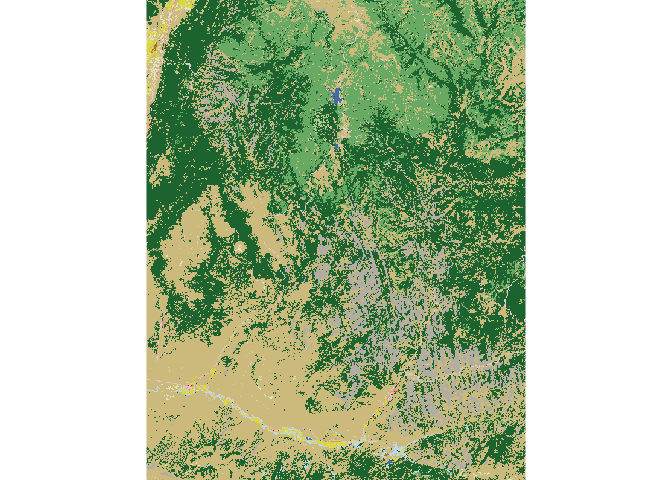<!-- -->

``` r
plot(cat_raster_wgs84) #上手く変換できずNULL値の場所があるのが分かる
```

<!-- -->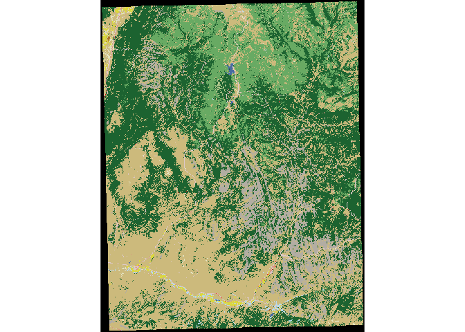<!-- -->

| CRS   | nrow | ncol |   ncell | resolution | unique\_categories |
|:------|-----:|-----:|--------:|-----------:|-------------------:|
| NAD83 | 1359 | 1073 | 1458207 |    31.5275 |                 14 |
| WGS84 | 1394 | 1111 | 1548734 |     0.0003 |                 15 |

Key attributes in the original (‘cat\_raster’) and projected
(‘cat\_raster\_wgs84’) categorical raster datasets.

# chapter 7

``` r
#外部からのデータ取り込み
library(sf)
library(raster)
library(dplyr)
library(spData)
```

``` r
#以下はリンク切れしている。このようにデータをダウンロードする。
#download.file(url = "http://nrdata.nps.gov/programs/lands/nps_boundary.zip",
#              destfile = "nps_boundary.zip")
#unzip(zipfile = "nps_boundary.zip")
#usa_parks = st_read(dsn = "nps_boundary.shp")
#ベクタファイルはst_read
```

``` r
library(rnaturalearth)
usa = ne_countries(country = "United States of America") # United States borders
class(usa)
```

    ## [1] "SpatialPolygonsDataFrame"
    ## attr(,"package")
    ## [1] "sp"

``` r
#これは古いクラス。こういったものはsfクラスに変換して扱うのが良い。
usa_sf = st_as_sf(usa)

#オープンストリートマップ
library(osmdata)
```

    ## Data (c) OpenStreetMap contributors, ODbL 1.0. https://www.openstreetmap.org/copyright

``` r
parks = opq(bbox = "leeds uk") %>% 
  add_osm_feature(key = "leisure", value = "park") %>% 
  osmdata_sf()
```

\#chapter7.5 file formats
<table>
<caption>
Selected spatial file formats.
</caption>
<thead>
<tr>
<th style="text-align:left;">
Name
</th>
<th style="text-align:left;">
Extension
</th>
<th style="text-align:left;">
Info
</th>
<th style="text-align:left;">
Type
</th>
<th style="text-align:left;">
Model
</th>
</tr>
</thead>
<tbody>
<tr>
<td style="text-align:left;">
ESRI Shapefile
</td>
<td style="text-align:left;width: 7em; ">
.shp (the main file)
</td>
<td style="text-align:left;width: 14em; ">
Popular format consisting of at least three files. No support for: files
&gt; 2GB; mixed types; names &gt; 10 chars; cols &gt; 255.
</td>
<td style="text-align:left;">
Vector
</td>
<td style="text-align:left;width: 7em; ">
Partially open
</td>
</tr>
<tr>
<td style="text-align:left;">
GeoJSON
</td>
<td style="text-align:left;width: 7em; ">
.geojson
</td>
<td style="text-align:left;width: 14em; ">
Extends the JSON exchange format by including a subset of the simple
feature representation.
</td>
<td style="text-align:left;">
Vector
</td>
<td style="text-align:left;width: 7em; ">
Open
</td>
</tr>
<tr>
<td style="text-align:left;">
KML
</td>
<td style="text-align:left;width: 7em; ">
.kml
</td>
<td style="text-align:left;width: 14em; ">
XML-based format for spatial visualization, developed for use with
Google Earth. Zipped KML file forms the KMZ format.
</td>
<td style="text-align:left;">
Vector
</td>
<td style="text-align:left;width: 7em; ">
Open
</td>
</tr>
<tr>
<td style="text-align:left;">
GPX
</td>
<td style="text-align:left;width: 7em; ">
.gpx
</td>
<td style="text-align:left;width: 14em; ">
XML schema created for exchange of GPS data.
</td>
<td style="text-align:left;">
Vector
</td>
<td style="text-align:left;width: 7em; ">
Open
</td>
</tr>
<tr>
<td style="text-align:left;">
GeoTIFF
</td>
<td style="text-align:left;width: 7em; ">
.tif/.tiff
</td>
<td style="text-align:left;width: 14em; ">
Popular raster format. A TIFF file containing additional spatial
metadata.
</td>
<td style="text-align:left;">
Raster
</td>
<td style="text-align:left;width: 7em; ">
Open
</td>
</tr>
<tr>
<td style="text-align:left;">
Arc ASCII
</td>
<td style="text-align:left;width: 7em; ">
.asc
</td>
<td style="text-align:left;width: 14em; ">
Text format where the first six lines represent the raster header,
followed by the raster cell values arranged in rows and columns.
</td>
<td style="text-align:left;">
Raster
</td>
<td style="text-align:left;width: 7em; ">
Open
</td>
</tr>
<tr>
<td style="text-align:left;">
R-raster
</td>
<td style="text-align:left;width: 7em; ">
.gri, .grd
</td>
<td style="text-align:left;width: 14em; ">
Native raster format of the R-package raster.
</td>
<td style="text-align:left;">
Raster
</td>
<td style="text-align:left;width: 7em; ">
Open
</td>
</tr>
<tr>
<td style="text-align:left;">
SQLite/SpatiaLite
</td>
<td style="text-align:left;width: 7em; ">
.sqlite
</td>
<td style="text-align:left;width: 14em; ">
Standalone relational database, SpatiaLite is the spatial extension of
SQLite.
</td>
<td style="text-align:left;">
Vector and raster
</td>
<td style="text-align:left;width: 7em; ">
Open
</td>
</tr>
<tr>
<td style="text-align:left;">
ESRI FileGDB
</td>
<td style="text-align:left;width: 7em; ">
.gdb
</td>
<td style="text-align:left;width: 14em; ">
Spatial and nonspatial objects created by ArcGIS. Allows: multiple
feature classes; topology. Limited support from GDAL.
</td>
<td style="text-align:left;">
Vector and raster
</td>
<td style="text-align:left;width: 7em; ">
Proprietary
</td>
</tr>
<tr>
<td style="text-align:left;">
GeoPackage
</td>
<td style="text-align:left;width: 7em; ">
.gpkg
</td>
<td style="text-align:left;width: 14em; ">
Lightweight database container based on SQLite allowing an easy and
platform-independent exchange of geodata
</td>
<td style="text-align:left;">
Vector and raster
</td>
<td style="text-align:left;width: 7em; ">
Open
</td>
</tr>
</tbody>
</table>

``` r
sf_drivers = st_drivers()　#パッケージ読み込みドライバを色々読み込む
head(sf_drivers, n = 5)
```

    ##                    name                                  long_name write  copy
    ## PCIDSK           PCIDSK                       PCIDSK Database File  TRUE FALSE
    ## netCDF           netCDF                 Network Common Data Format  TRUE  TRUE
    ## PDS4               PDS4               NASA Planetary Data System 4  TRUE  TRUE
    ## JP2OpenJPEG JP2OpenJPEG JPEG-2000 driver based on OpenJPEG library FALSE  TRUE
    ## PDF                 PDF                             Geospatial PDF  TRUE  TRUE
    ##             is_raster is_vector  vsi
    ## PCIDSK           TRUE      TRUE TRUE
    ## netCDF           TRUE      TRUE TRUE
    ## PDS4             TRUE      TRUE TRUE
    ## JP2OpenJPEG      TRUE      TRUE TRUE
    ## PDF              TRUE      TRUE TRUE

``` r
vector_filepath = system.file("shapes/world.gpkg", package = "spData")
world = st_read(vector_filepath)
```

    ## Reading layer `world' from data source `/usr/local/lib/R/site-library/spData/shapes/world.gpkg' using driver `GPKG'
    ## Simple feature collection with 177 features and 10 fields
    ## Geometry type: MULTIPOLYGON
    ## Dimension:     XY
    ## Bounding box:  xmin: -180 ymin: -90 xmax: 180 ymax: 83.64513
    ## Geodetic CRS:  WGS 84

``` r
cycle_hire_txt = system.file("misc/cycle_hire_xy.csv", package = "spData")
cycle_hire_xy = st_read(cycle_hire_txt, options = c("X_POSSIBLE_NAMES=X",
                                                    "Y_POSSIBLE_NAMES=Y"))
```

    ## options:        X_POSSIBLE_NAMES=X Y_POSSIBLE_NAMES=Y 
    ## Reading layer `cycle_hire_xy' from data source `/usr/local/lib/R/site-library/spData/misc/cycle_hire_xy.csv' using driver `CSV'
    ## Simple feature collection with 742 features and 7 fields
    ## Geometry type: POINT
    ## Dimension:     XY
    ## Bounding box:  xmin: -0.2367699 ymin: 51.45475 xmax: -0.002275 ymax: 51.54214
    ## CRS:           NA

``` r
#well known text(well known binary)はデータ圧縮率を高めるための形式
world_txt = system.file("misc/world_wkt.csv", package = "spData")
world_wkt = read_sf(world_txt, options = "GEOM_POSSIBLE_NAMES=WKT")
# the same as
world_wkt = st_read(world_txt, options = "GEOM_POSSIBLE_NAMES=WKT", 
                    quiet = TRUE, stringsAsFactors = FALSE, as_tibble = TRUE)

#ラスターデータ
raster_filepath = system.file("raster/srtm.tif", package = "spDataLarge")
single_layer = raster(raster_filepath)

multilayer_filepath = system.file("raster/landsat.tif", package = "spDataLarge")
band3 = raster(multilayer_filepath, band = 3)

multilayer_brick = brick(multilayer_filepath) #メモリに乗せる
multilayer_stack = stack(multilayer_filepath) #メモリに乗せず、ポインタのみ
plot(multilayer_brick)
```

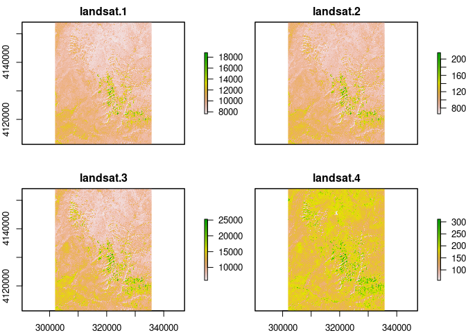<!-- -->

``` r
# data output
st_write(obj = world, dsn = "world.gpkg")
```

    ## Writing layer `world' to data source `world.gpkg' using driver `GPKG'
    ## Writing 177 features with 10 fields and geometry type Multi Polygon.

``` r
st_write(obj = world, dsn = "world.shp") #.shpは面倒臭い(大量のメッセージファイル、複数のファイルで1つのデータ)
```

    ## Writing layer `world' to data source `world.shp' using driver `ESRI Shapefile'
    ## Writing 177 features with 10 fields and geometry type Multi Polygon.

    ## Warning in CPL_write_ogr(obj, dsn, layer, driver,
    ## as.character(dataset_options), : GDAL Message 1: Value 318622525 of field pop
    ## of feature 4 not successfully written. Possibly due to too larger number with
    ## respect to field width

    ## Warning in CPL_write_ogr(obj, dsn, layer, driver,
    ## as.character(dataset_options), : GDAL Message 1: Value 255131116 of field pop
    ## of feature 8 not successfully written. Possibly due to too larger number with
    ## respect to field width

    ## Warning in CPL_write_ogr(obj, dsn, layer, driver,
    ## as.character(dataset_options), : GDAL Message 1: Value 143819666 of field pop
    ## of feature 18 not successfully written. Possibly due to too larger number with
    ## respect to field width

    ## Warning in CPL_write_ogr(obj, dsn, layer, driver,
    ## as.character(dataset_options), : GDAL Message 1: Value 124221600 of field pop
    ## of feature 27 not successfully written. Possibly due to too larger number with
    ## respect to field width

    ## Warning in CPL_write_ogr(obj, dsn, layer, driver,
    ## as.character(dataset_options), : GDAL Message 1: Value 204213133 of field pop
    ## of feature 29 not successfully written. Possibly due to too larger number with
    ## respect to field width

    ## Warning in CPL_write_ogr(obj, dsn, layer, driver,
    ## as.character(dataset_options), : GDAL Message 1: Value 176460502 of field pop
    ## of feature 56 not successfully written. Possibly due to too larger number with
    ## respect to field width

    ## Warning in CPL_write_ogr(obj, dsn, layer, driver,
    ## as.character(dataset_options), : GDAL Message 1: Value 1293859294 of field pop
    ## of feature 98 not successfully written. Possibly due to too larger number with
    ## respect to field width

    ## Warning in CPL_write_ogr(obj, dsn, layer, driver,
    ## as.character(dataset_options), : GDAL Message 1: Value 159405279 of field pop
    ## of feature 99 not successfully written. Possibly due to too larger number with
    ## respect to field width

    ## Warning in CPL_write_ogr(obj, dsn, layer, driver,
    ## as.character(dataset_options), : GDAL Message 1: Value 185546257 of field pop
    ## of feature 102 not successfully written. Possibly due to too larger number with
    ## respect to field width

    ## Warning in CPL_write_ogr(obj, dsn, layer, driver,
    ## as.character(dataset_options), : GDAL Message 1: Value 1364270000 of field pop
    ## of feature 139 not successfully written. Possibly due to too larger number with
    ## respect to field width

    ## Warning in CPL_write_ogr(obj, dsn, layer, driver,
    ## as.character(dataset_options), : GDAL Message 1: Value 100102249 of field pop
    ## of feature 147 not successfully written. Possibly due to too larger number with
    ## respect to field width

    ## Warning in CPL_write_ogr(obj, dsn, layer, driver,
    ## as.character(dataset_options), : GDAL Message 1: Value 127276000 of field pop
    ## of feature 155 not successfully written. Possibly due to too larger number with
    ## respect to field width

``` r
st_write(obj = world, dsn = "world.gpkg", append = TRUE) #既存ファイルへデータ追加
```

    ## Updating layer `world' to data source `world.gpkg' using driver `GPKG'
    ## Updating existing layer world
    ## Writing 177 features with 10 fields and geometry type Multi Polygon.

<table>
<caption>
Data types supported by the raster package.
</caption>
<thead>
<tr>
<th style="text-align:left;">
Data type
</th>
<th style="text-align:left;">
Minimum value
</th>
<th style="text-align:left;">
Maximum value
</th>
</tr>
</thead>
<tbody>
<tr>
<td style="text-align:left;">
LOG1S
</td>
<td style="text-align:left;">
FALSE (0)
</td>
<td style="text-align:left;">
TRUE (1)
</td>
</tr>
<tr>
<td style="text-align:left;">
INT1S
</td>
<td style="text-align:left;">
-127
</td>
<td style="text-align:left;">
127
</td>
</tr>
<tr>
<td style="text-align:left;">
INT1U
</td>
<td style="text-align:left;">
0
</td>
<td style="text-align:left;">
255
</td>
</tr>
<tr>
<td style="text-align:left;">
INT2S
</td>
<td style="text-align:left;">
-32,767
</td>
<td style="text-align:left;">
32,767
</td>
</tr>
<tr>
<td style="text-align:left;">
INT2U
</td>
<td style="text-align:left;">
0
</td>
<td style="text-align:left;">
65,534
</td>
</tr>
<tr>
<td style="text-align:left;">
INT4S
</td>
<td style="text-align:left;">
-2,147,483,647
</td>
<td style="text-align:left;">
2,147,483,647
</td>
</tr>
<tr>
<td style="text-align:left;">
INT4U
</td>
<td style="text-align:left;">
0
</td>
<td style="text-align:left;">
4,294,967,296
</td>
</tr>
<tr>
<td style="text-align:left;">
FLT4S
</td>
<td style="text-align:left;">
-3.4e+38
</td>
<td style="text-align:left;">
3.4e+38
</td>
</tr>
<tr>
<td style="text-align:left;">
FLT8S
</td>
<td style="text-align:left;">
-1.7e+308
</td>
<td style="text-align:left;">
1.7e+308
</td>
</tr>
</tbody>
</table>

``` r
writeRaster(single_layer, filename = "my_raster.tif", datatype = "INT2U") #ラスター版出力
writeRaster(x = single_layer,
            filename = "my_raster2.tif",
            datatype = "INT2U",
            options = c("COMPRESS=DEFLATE"),
            overwrite = TRUE) #細かく指定
```

``` r
#image output
#png(filename = "lifeExp.png", width = 500, height = 350)
#plot(world["lifeExp"])
#dev.off()

#こっちでも可
#library(tmap)
#tmap_obj = tm_shape(world) + tm_polygons(col = "lifeExp")
#tmap_save(tm = tmap_obj, filename = "lifeExp_tmap.png")

# htmlなら動く図なんかも保存可能(らしい)
#library(mapview)
#mapview_obj = mapview(world, zcol = "lifeExp", legend = TRUE)
#mapshot(mapview_obj, file = "my_interactive_map.html")
```

``` r
#宿題
#administrative area
unzip(zipfile = "../data/JPN_adm.zip", exdir="./JPN_adm")
jpn_adm0 = st_read(dsn = "./JPN_adm/JPN_adm0.shp")
```

    ## Reading layer `JPN_adm0' from data source `/home/rstudio/class/l09-10/JPN_adm/JPN_adm0.shp' using driver `ESRI Shapefile'
    ## Simple feature collection with 1 feature and 70 fields
    ## Geometry type: MULTIPOLYGON
    ## Dimension:     XY
    ## Bounding box:  xmin: 122.9332 ymin: 24.04542 xmax: 153.9869 ymax: 45.52279
    ## Geodetic CRS:  WGS 84

``` r
plot(jpn_adm0)
```

    ## Warning: plotting the first 9 out of 70 attributes; use max.plot = 70 to plot
    ## all

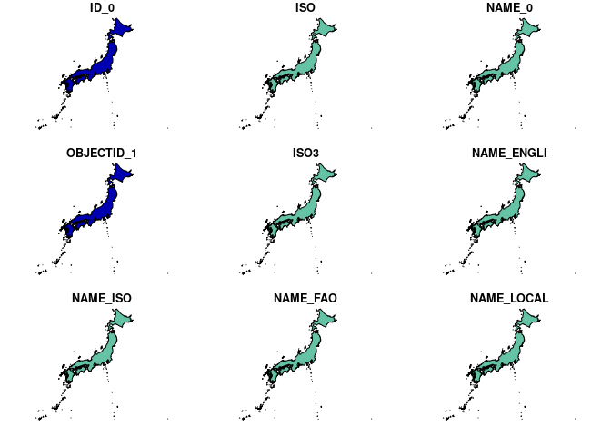<!-- -->

``` r
#elevation
unzip(zipfile = "../data/JPN_alt.zip", exdir="./JPN_alt")
jpn_alt = raster("./JPN_alt/JPN_alt.gri")
```

    ## Warning in showSRID(uprojargs, format = "PROJ", multiline = "NO", prefer_proj
    ## = prefer_proj): Discarded datum Unknown based on WGS84 ellipsoid in Proj4
    ## definition

``` r
plot(jpn_alt)
```

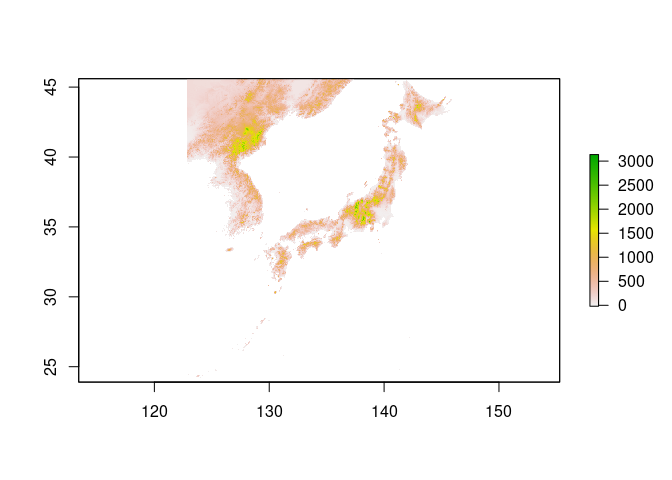<!-- -->

``` r
#population
unzip(zipfile = "../data/JPN_pop.zip", exdir="./JPN_pop")
jpn_pop = raster("./JPN_pop/JPN_pop.gri")
plot(jpn_pop)
```

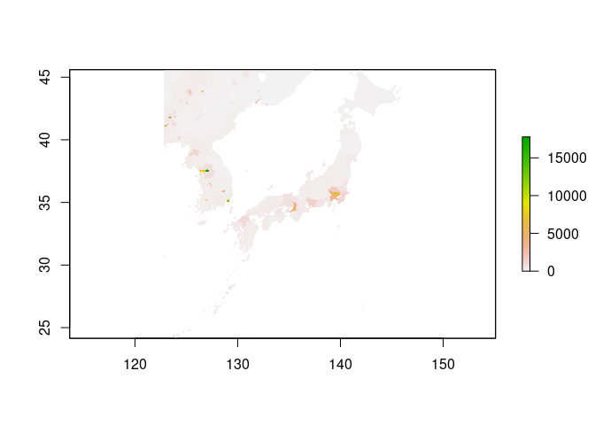<!-- -->

``` r
jpn_adm0
```

    ## Simple feature collection with 1 feature and 70 fields
    ## Geometry type: MULTIPOLYGON
    ## Dimension:     XY
    ## Bounding box:  xmin: 122.9332 ymin: 24.04542 xmax: 153.9869 ymax: 45.52279
    ## Geodetic CRS:  WGS 84
    ##   ID_0 ISO NAME_0 OBJECTID_1 ISO3 NAME_ENGLI NAME_ISO NAME_FAO NAME_LOCAL
    ## 1  114 JPN  Japan        118  JPN      Japan    JAPAN    Japan     Nippon
    ##   NAME_OBSOL           NAME_VARIA NAME_NONLA NAME_FRENC NAME_SPANI NAME_RUSSI
    ## 1       <NA> Japan|Ryukyu Islands       <NA>      Japon      Japón     Япония
    ##   NAME_ARABI NAME_CHINE WASPARTOF CONTAINS SOVEREIGN ISO2  WWW FIPS ISON
    ## 1    اليابان       日本      <NA>     <NA>     Japan   JP <NA>   JA  392
    ##    VALIDFR VALIDTO   POP2000     SQKM  POPSQKM    UNREGION1 UNREGION2
    ## 1 19470402 Present 127096314 373049.4 340.6957 Eastern Asia      Asia
    ##   DEVELOPING CIS Transition OECD WBREGION          WBINCOME              WBDEBT
    ## 1          2   0          0    1     <NA> High income: OECD Debt not classified
    ##   WBOTHER CEEAC CEMAC CEPLG COMESA EAC ECOWAS IGAD IOC MRU SACU UEMOA UMA PALOP
    ## 1    <NA>     0     0     0      0   0      0    0   0   0    0     0   0     0
    ##   PARTA CACM EurAsEC Agadir SAARC ASEAN NAFTA GCC CSN CARICOM EU CAN ACP
    ## 1     0    0       0      0     0     0     0   0   0       0  0   0   0
    ##   Landlocked AOSIS SIDS Islands LDC                       geometry
    ## 1          0     0    0       1   0 MULTIPOLYGON (((123.7879 24...

# chapter 8

``` r
library(sf)
library(raster)
library(dplyr)
library(spData)
library(spDataLarge)
```

``` r
library(tmap)    # for static and interactive maps
library(leaflet) # for interactive maps
library(ggplot2) # tidyverse data visualization package
```

``` r
#tmap(描画ライブラリ)の基本的な使い方

# Add fill layer to nz shape
tm_shape(nz) +
  tm_fill() 
```

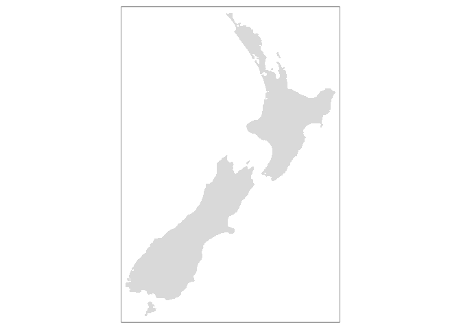<!-- -->

``` r
# Add border layer to nz shape
tm_shape(nz) +
  tm_borders() 
```

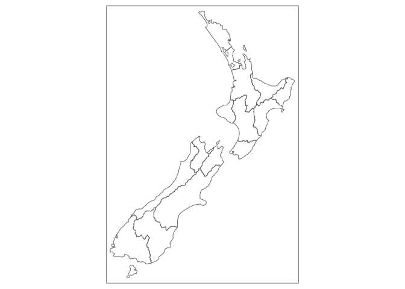<!-- -->

``` r
# Add fill and border layers to nz shape
tm_shape(nz) +
  tm_fill() +
  tm_borders()
```

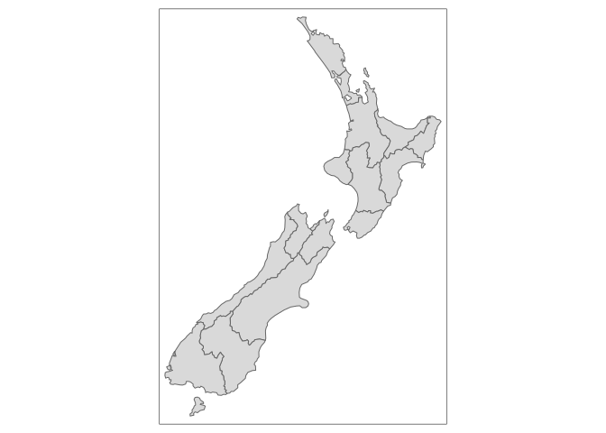<!-- -->

``` r
map_nz = tm_shape(nz) + tm_polygons()
map_nz1 = map_nz +
  tm_shape(nz_elev) + tm_raster(alpha = 0.7) #重ねているが、透明度を指定しているので透けて見える
nz_water = st_union(nz) %>% st_buffer(22200) %>% 
  st_cast(to = "LINESTRING")
map_nz2 = map_nz1 +
  tm_shape(nz_water) + tm_lines()
map_nz3 = map_nz2 +
  tm_shape(nz_height) + tm_dots()
tmap_arrange(map_nz1, map_nz2, map_nz3)
```

    ## stars object downsampled to 877 by 1140 cells. See tm_shape manual (argument raster.downsample)
    ## stars object downsampled to 877 by 1140 cells. See tm_shape manual (argument raster.downsample)
    ## stars object downsampled to 877 by 1140 cells. See tm_shape manual (argument raster.downsample)
    ## stars object downsampled to 877 by 1140 cells. See tm_shape manual (argument raster.downsample)

    ## Some legend labels were too wide. These labels have been resized to 0.64, 0.56, 0.56, 0.56, 0.56, 0.56. Increase legend.width (argument of tm_layout) to make the legend wider and therefore the labels larger.

    ## stars object downsampled to 877 by 1140 cells. See tm_shape manual (argument raster.downsample)

    ## Some legend labels were too wide. These labels have been resized to 0.64, 0.56, 0.56, 0.56, 0.56, 0.56. Increase legend.width (argument of tm_layout) to make the legend wider and therefore the labels larger.

    ## stars object downsampled to 877 by 1140 cells. See tm_shape manual (argument raster.downsample)

    ## Some legend labels were too wide. These labels have been resized to 0.64, 0.56, 0.56, 0.56, 0.56, 0.56. Increase legend.width (argument of tm_layout) to make the legend wider and therefore the labels larger.

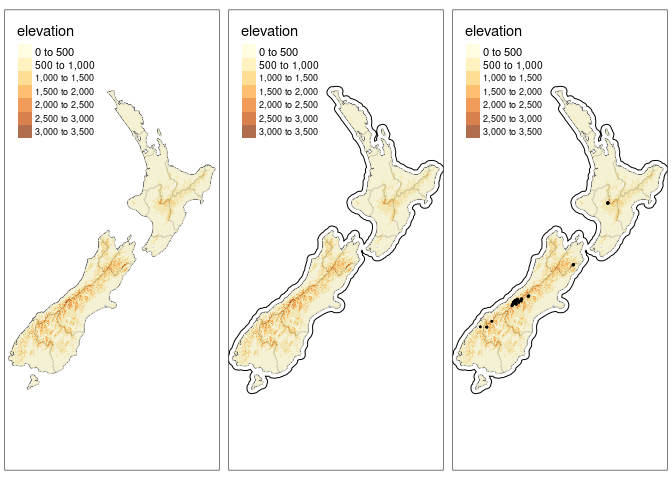<!-- -->

``` r
ma1 = tm_shape(nz) + tm_fill(col = "red")
ma2 = tm_shape(nz) + tm_fill(col = "red", alpha = 0.3)
ma3 = tm_shape(nz) + tm_borders(col = "blue")
ma4 = tm_shape(nz) + tm_borders(lwd = 3)
ma5 = tm_shape(nz) + tm_borders(lty = 2)
ma6 = tm_shape(nz) + tm_fill(col = "red", alpha = 0.3) +
  tm_borders(col = "blue", lwd = 3, lty = 2)
tmap_arrange(ma1, ma2, ma3, ma4, ma5, ma6)
```

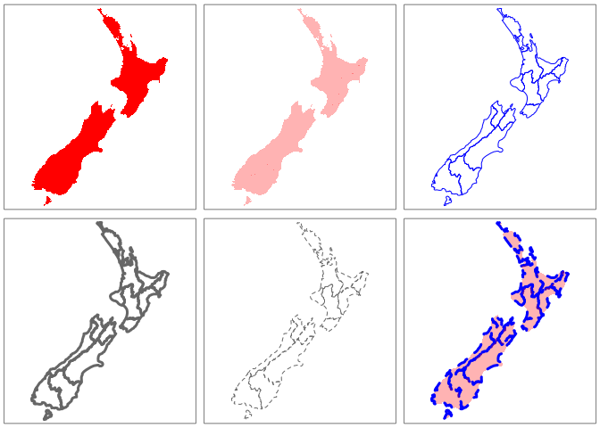<!-- -->

``` r
#plotとtmapの違い
plot(nz["Land_area"])
```

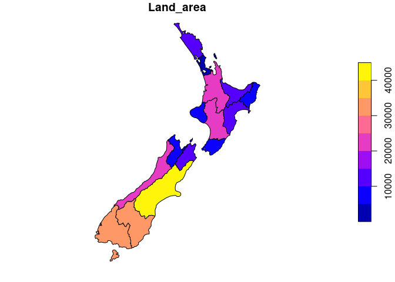<!-- -->

``` r
tm_shape(nz) + tm_fill(col = "Land_area")
```

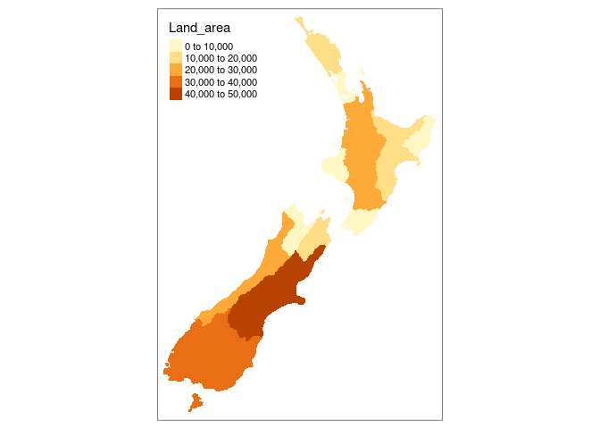<!-- -->

``` r
legend_title = expression("Area (km"^2*")") #タイトルの付け方
map_nza = tm_shape(nz) +
  tm_fill(col = "Land_area", title = legend_title) + tm_borders()

tm_shape(nz) + tm_polygons(col = "Median_income") #デフォルトは6段階に分ける
```

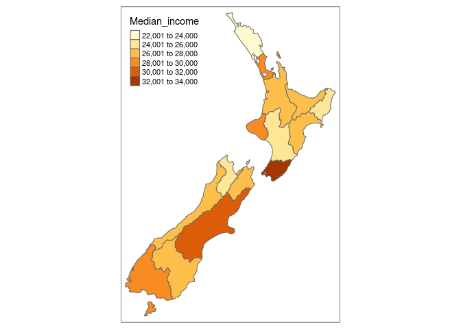<!-- -->

``` r
breaks = c(0, 3, 4, 5) * 10000
tm_shape(nz) + tm_polygons(col = "Median_income", breaks = breaks) #0,3万,4万,5万で分ける
```

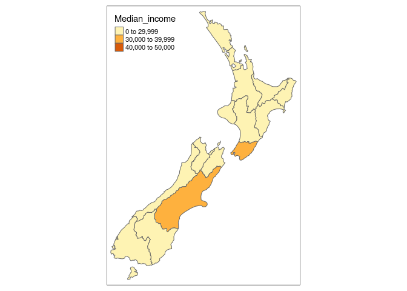<!-- -->

``` r
tm_shape(nz) + tm_polygons(col = "Median_income", n = 10) #10段階で分ける
```

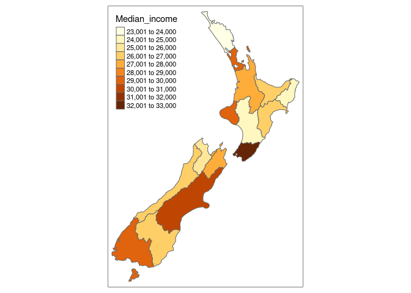<!-- -->

``` r
tm_shape(nz) + tm_polygons(col = "Median_income", palette = "BuGn") #色を変える
```

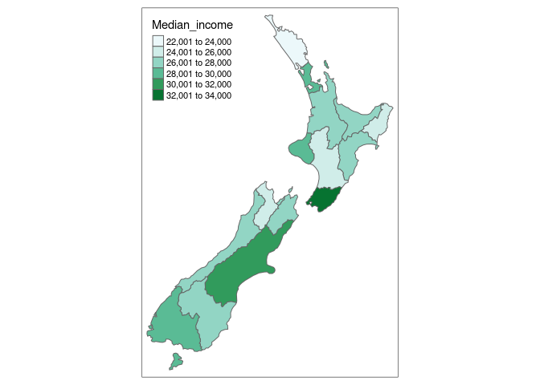<!-- -->

``` r
tm_shape(nz) + tm_polygons("Population", palette = "Blues")
```

    ## Some legend labels were too wide. These labels have been resized to 0.65, 0.60, 0.60. Increase legend.width (argument of tm_layout) to make the legend wider and therefore the labels larger.

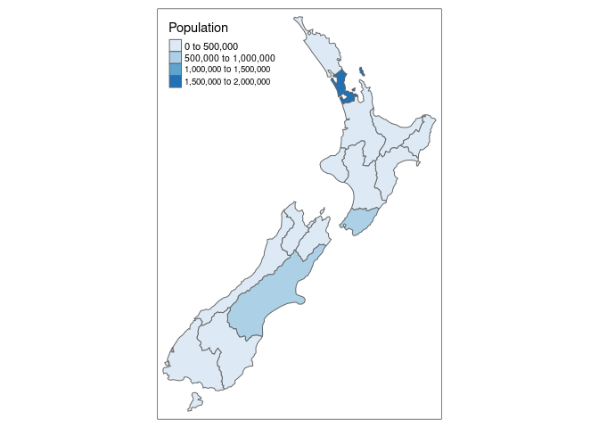<!-- -->

``` r
tm_shape(nz) + tm_polygons("Population", palette = "YlOrBr")
```

    ## Some legend labels were too wide. These labels have been resized to 0.65, 0.60, 0.60. Increase legend.width (argument of tm_layout) to make the legend wider and therefore the labels larger.

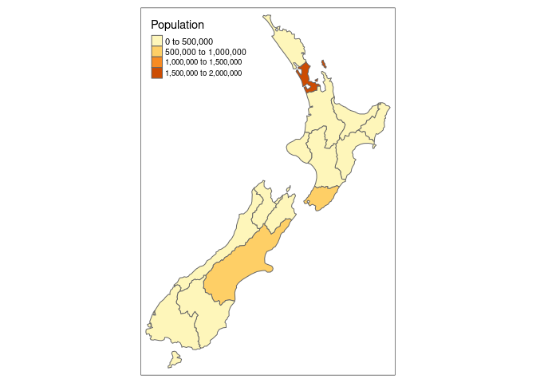<!-- -->

``` r
map_nz + 
  tm_compass(type = "8star", position = c("left", "top")) +
  tm_scale_bar(breaks = c(0, 100, 200), text.size = 1)
```

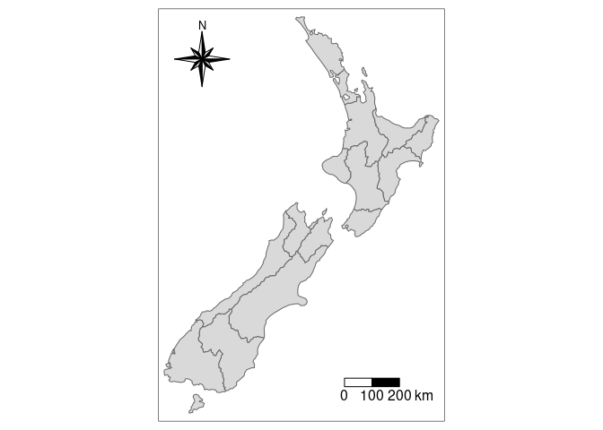<!-- -->

``` r
#色々オシャレにできる
map_nz + tm_layout(title = "New Zealand")
```

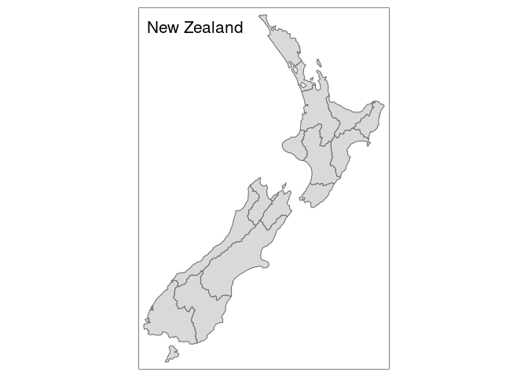<!-- -->

``` r
map_nz + tm_layout(scale = 5)
```

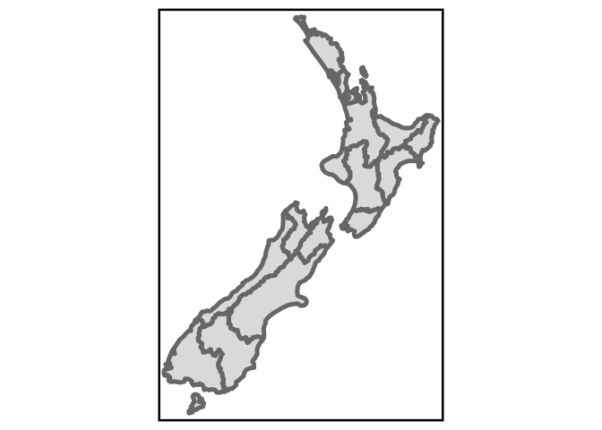<!-- -->

``` r
map_nz + tm_layout(bg.color = "lightblue")
```

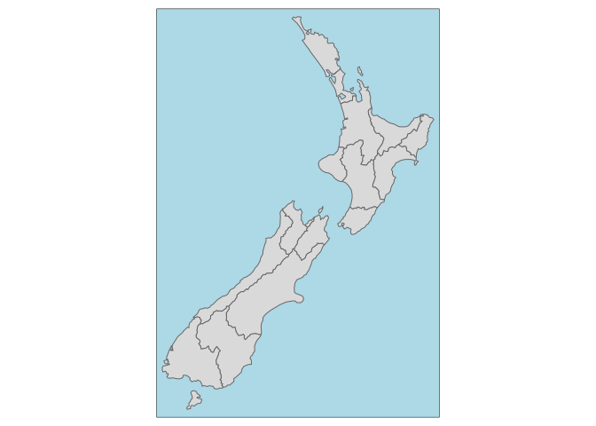<!-- -->

``` r
map_nz + tm_layout(frame = FALSE)
```

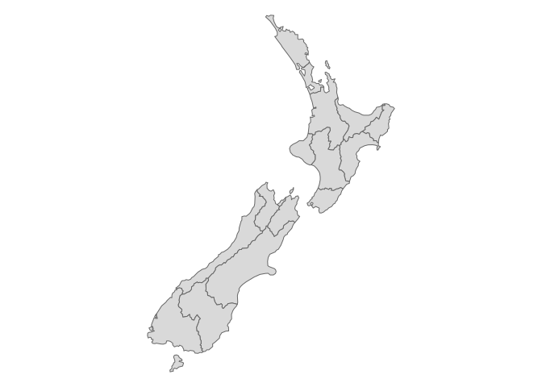<!-- -->
